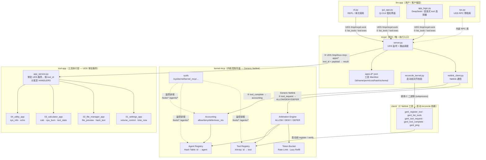

# linux-mcp

一个“内核治理 + 用户态语义编排”的 MCP 原型系统。  
目标是把 **准入控制与审计** 放在内核，把 **语义与工具执行** 放在用户态，并通过统一网关 `mcpd` 闭环串起来。

## 1. 项目创新点

1. 内核只做控制平面，不做业务语义：
   - 使用 Generic Netlink 维护 tool/agent 注册、仲裁与计量；
   - 明确禁止内核解析 JSON，降低内核复杂度与安全风险。
2. `mcpd` 作为唯一执行网关：
   - `llm-app` 只和 `mcpd` 通信；
   - `mcpd` 强制“仲裁成功后才执行工具”，并回写 completion。
3. App 级工具组织（而非散装脚本）：
   - 每个 app 一个 manifest：`mcpd/apps.d/*.json`；
   - 每个 app 一个实现模块：`tool-app/apps/*.py`；
   - 单 app 常驻 socket，按 `tool_id` 分发到 `HANDLERS`。
4. 语义哈希绑定：
   - 对 `tool_id/name/app_id/app_name/perm/cost/description/input_schema/examples` 计算短哈希；
   - 启动前 reconcile，确保 manifest 与内核注册表 1:1 对齐。

## 2. 框架总览图

> 完整高清架构图见 [`docs/architecture.png`](docs/architecture.png)



## 3. 流程框架（端到端）

1. `llm-app -> mcpd` 请求 `list_apps/list_tools`，做 app->tool 选择。
2. `llm-app -> mcpd` 发 `tool:exec`（含 `app_id`、`tool_id`、`payload`）。
3. `mcpd -> kernel_mcp` 发 `tool_request` 仲裁（ALLOW/DENY/DEFER）。
4. ALLOW 后，`mcpd -> tool-app/app_service`（Unix socket）执行对应 handler。
5. 执行结束后 `mcpd -> kernel_mcp` 发 `tool_complete` 记账。
6. `mcpd -> llm-app` 返回最终结果。

## 4. 技术难点与解决思路

1. 内核与语义解耦：
   - 难点：既要内核可治理，又不能把语义逻辑塞进内核；
   - 方案：内核仅接受结构化字段（id/perm/cost/hash），语义全在 manifest。
2. 多进程工具调度开销：
   - 难点：每次子进程调用成本高；
   - 方案：改为 app 级常驻 socket + 持久服务，避免频繁 fork/exec。
3. 一致性与漂移：
   - 难点：manifest 更新后，内核注册与网关缓存可能不一致；
   - 方案：`run_mcpd.sh` 启动前强制 reconcile，不一致直接 fail-fast。
4. 受控文件工具安全边界：
   - 难点：文件类工具容易越权访问；
   - 方案：统一相对路径、禁止 `..`、限制 repo-root 范围。

## 5. 目录分层（精简版）

核心必需（运行主链路）：
- `kernel-mcp/`：内核模块
- `mcpd/`：网关与 reconcile
- `mcpd/apps.d/`：app manifests
- `tool-app/`：app_service 与 app handlers
- `llm-app/`：CLI/GUI 客户端
- `client/`：C netlink 工具（当前 reconcile 依赖）
- `scripts/`：启动/停止/验证脚本

可选组件（不影响主链路）：
- `bench/`：性能压测与绘图
- `results/`、`plots/`：压测输出目录（按需创建）

关于 `client` 与 `bench` 是否有必要：
- `client`：**当前有必要**。`mcpd/reconcile_kernel.py` 依赖 `genl_register_tool/genl_list_tools`。
- `bench`：**非必要**。只用于 Phase 5 压测，可在最小部署中忽略。

## 6. 快速运行

1. 编译 client 工具：

```bash
make -C client clean
make -C client
```

2. 编译并加载内核模块：

```bash
sudo bash scripts/load_module.sh
```

3. 启动 app 服务与 mcpd：

```bash
bash scripts/run_tool_services.sh
bash scripts/run_mcpd.sh
```

4. 发起一次请求：

```bash
python3 llm-app/cli.py --selector heuristic --once "calculate (21+7)*3"
```

5. 停止服务：

```bash
bash scripts/stop_mcpd.sh
bash scripts/stop_tool_services.sh
```

## 7. 新增一个工具（推荐路径）

1. 在对应 app 模块中新增 handler（`tool-app/apps/<app>.py`，加入 `HANDLERS`）。
2. 在 `mcpd/apps.d/<app>.json` 的 `tools[]` 追加：
   - `tool_id/name/perm/cost/handler`
   - `description/input_schema/examples`
3. 重新启动：

```bash
bash scripts/run_tool_services.sh
bash scripts/run_mcpd.sh
```

## 8. 项目清理（只保留源码）

```bash
bash scripts/clean_repo.sh
```
