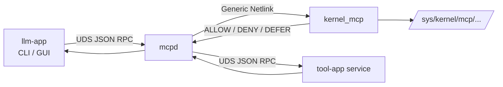
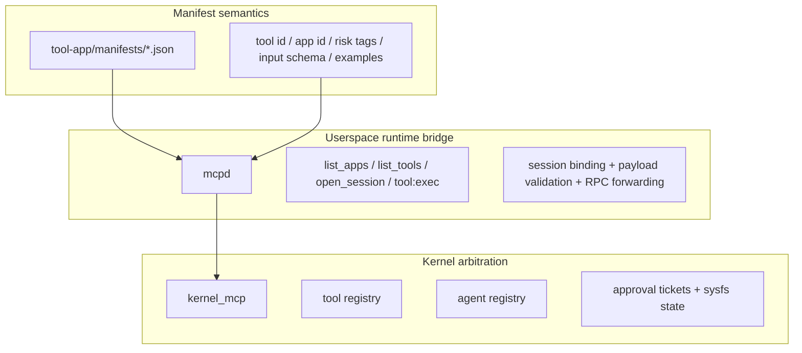

# linux-mcp


`linux-mcp` is a clean-room prototype for a kernel-assisted MCP-style control plane on Linux. It combines:

- a Linux kernel module for control-plane arbitration and state exposure
- a userspace gateway that understands tool semantics and runtime endpoints
- demo tool services exposed over Unix domain sockets
- an LLM-driven CLI and GUI client

The repository is not a phase-based sketch. It is a runnable end-to-end system with a concrete request path, a concrete tool manifest format, and a maintained experiment workflow.

## At a Glance

| Topic | Summary |
|---|---|
| Core idea | Keep execution in userspace, but move control-plane arbitration and durable visibility into the kernel |
| Execution path | `llm-app -> mcpd -> kernel arbitration -> tool-app -> mcpd -> llm-app` |
| Semantic source of truth | `tool-app/manifests/*.json` |
| Runtime gateway | `mcpd` |
| Kernel interface | Generic Netlink + sysfs |
| Main experiments | linux_mcp comparative evaluation plus two supplementary experiments: semantic-hash runtime substitution and Generic Netlink RTT microbenchmark |
| Retained results | 3 actively referenced snapshots under [experiment-results/](experiment-results/): 1 main run and 2 supplementary experiments |

## Highlights

- Kernel-visible control-plane state without moving tool execution into the kernel
- Manifest-driven catalog export through `list_apps` and `list_tools`
- Session binding against real UDS peer credentials
- Approval-gated mediation for risky tools
- A paper-ready `linux_mcp` snapshot with controlled-noise latency, throughput, attack, and daemon-failure results
- Sysfs-backed observability for debugging and post-crash inspection

## seccomp in this repo

`seccomp` (secure computing mode) is Linux syscall filtering.
In this repository, `seccomp` means a hardened userspace baseline (`userspace + sandbox + audit logging + stricter checks`) used as the comparison target.

## Overview

### What this project demonstrates

- Kernel-visible control-plane state for tool mediation
- Userspace execution with kernel-backed arbitration
- Manifest-driven app and tool discovery
- Session binding between a client process and mediated tool requests
- Approval-gated execution for risky tools
- Sysfs visibility for post-mortem inspection and debugging

### What this project does not try to do

- It does not move tool execution into the kernel
- It does not parse JSON in kernel space
- It is not a general policy engine
- It does not claim complete execution security

## Architecture

### End-to-end request path



### Control-plane split



### Request lifecycle

```text
1. mcpd loads tool manifests
2. mcpd registers manifest tools in the kernel
3. llm-app queries list_apps / list_tools
4. llm-app opens a short-lived session
5. mcpd binds the session to UDS peer credentials
6. tool:exec is arbitrated by the kernel
7. mcpd forwards the call to the selected tool-app service
8. completion is reported back to the kernel
9. state remains inspectable through sysfs
```

### Design principles

| Principle | How the repository applies it |
|---|---|
| Kernel is control plane only | No JSON parsing or tool execution in kernel space |
| Userspace owns semantics | `mcpd` loads manifests, validates payloads, and knows endpoints |
| Manifest is authoritative | Tool identity, hash, risk tags, examples, and input schema come from manifests |
| Client is mediated | `llm-app` never talks directly to tool services |
| Observability matters | Agent and tool state remain visible through sysfs |

## Repository Layout

```text
linux-mcp/
├── kernel-mcp/        Linux kernel module and UAPI-facing control-plane logic
├── mcpd/              Userspace gateway, manifest loader, session store, RPC server
├── tool-app/          Demo tool services and manifest definitions
├── llm-app/           CLI and GUI client
├── client/            Schema constants and low-level client/debug helpers
├── scripts/           Build, launch, stop, smoke, acceptance, and experiment entrypoints
├── experiment-results/ Retained final and repeated experiment outputs
└── README.md
```

### Directory guide

| Path | Purpose |
|---|---|
| [kernel-mcp/](/home/lxh/Code/linux-mcp/kernel-mcp) | Kernel module source. Implements Generic Netlink commands, tool and agent state, approval tickets, and sysfs exposure. |
| [mcpd/](/home/lxh/Code/linux-mcp/mcpd) | Control-plane gateway. Loads manifests, reconciles tool state with the kernel, validates requests, and forwards tool RPCs. |
| [tool-app/](/home/lxh/Code/linux-mcp/tool-app) | Demo app backends and manifest files. This repository intentionally treats this directory as the semantic source of truth. |
| [llm-app/](/home/lxh/Code/linux-mcp/llm-app) | User-facing clients. The CLI and GUI both route exclusively through `mcpd`. |
| [client/](/home/lxh/Code/linux-mcp/client) | Shared schema constants and simple helpers for debugging or low-level interaction. |
| [scripts/](/home/lxh/Code/linux-mcp/scripts) | Operational entrypoints for build, launch, smoke checks, acceptance, and experiments. |
| [experiment-results/](/home/lxh/Code/linux-mcp/experiment-results) | Curated experiment artifacts kept in-tree for reference. |

## Component Responsibilities

### `kernel-mcp`

The kernel module is the control-plane enforcement point, not the execution engine.
It provides the `KERNEL_MCP` Generic Netlink family, tool/agent state, approval tickets, binding checks, and sysfs exposure under `/sys/kernel/mcp/...`.
The demo policy is intentionally simple: deny unknown agents and hash mismatches, defer risky tools, allow the rest.

### `mcpd`

`mcpd` is the only component that understands both tool semantics and runtime endpoints.
It loads manifests, computes hashes, registers tools in the kernel, exposes `/tmp/mcpd.sock`, binds sessions to UDS peers, validates payloads, forwards tool RPCs, and reports completion back to the kernel.

### `tool-app`

`tool-app` contains demo backends and manifest definitions. The authoritative catalog lives in `tool-app/manifests/*.json` and is surfaced at runtime through `mcpd`.

### `llm-app`

`llm-app` provides both CLI and GUI frontends. It talks only to `mcpd` through `list_apps`, `list_tools`, `open_session`, and `tool:exec`. The current planner depends on `DEEPSEEK_API_KEY`.

## Manifest Model

The manifest layer is the semantic source of truth for the system.

### Current constraints

- only `transport = "uds_rpc"` is supported
- endpoints must live under `/tmp/linux-mcp-apps/`
- manifest semantics are hashed into exported tool identity

## Getting Started

### Requirements

| Category | Requirement |
|---|---|
| OS | Linux |
| Build | `bash`, `make`, `gcc`, `python3` |
| Kernel build | headers for `$(uname -r)` at `/lib/modules/$(uname -r)/build` |
| Privileges | root for kernel module load/unload |
| LLM client | `DEEPSEEK_API_KEY` |
| GUI | `PySide6` |

### Quick start

```bash
cd ~/Code/linux-mcp
bash scripts/run_smoke.sh
sudo bash scripts/build_kernel.sh
sudo bash scripts/unload_module.sh || true
sudo bash scripts/load_module.sh
make schema-verify
bash scripts/run_tool_services.sh
bash scripts/run_mcpd.sh
export DEEPSEEK_API_KEY="your_key"
python3 llm-app/cli.py --once "show system info"
```

### Shutdown

```bash
bash scripts/stop_mcpd.sh
bash scripts/stop_tool_services.sh
sudo bash scripts/unload_module.sh
```

### GUI

```bash
cd ~/Code/linux-mcp
source .venv/bin/activate
python llm-app/gui_app.py
```

## Observability

### Kernel state

```bash
ls /sys/kernel/mcp/tools
cat /sys/kernel/mcp/tools/2/name
cat /sys/kernel/mcp/tools/2/hash

ls /sys/kernel/mcp/agents
cat /sys/kernel/mcp/agents/a1/allow
cat /sys/kernel/mcp/agents/a1/defer
cat /sys/kernel/mcp/agents/a1/completed_ok
cat /sys/kernel/mcp/agents/a1/last_reason
cat /sys/kernel/mcp/agents/a1/last_exec_ms
```

### Userspace logs

```bash
cat /tmp/mcpd-$(id -u).log
ls /tmp/linux-mcp-app-*.log
```

## Experiments

> All the experiments are conducted on experiment/evaluation-suite-20260403 branch.

Experiment-specific details live in [scripts/experiments/README.md](scripts/experiments/README.md).

At repository level, the curated outputs are the main linux_mcp comparative run plus two supplementary experiments.

### Experiment entrypoints

| Command | Scope |
|---|---|
| `bash scripts/run_linux_mcp_evaluation.sh` | Single linux_mcp evaluation |
| `bash scripts/run_repeated_linux_mcp.sh` | Repeated linux_mcp runs |
| `bash scripts/run_security_evaluation.sh` | Attack-driven security evaluation (optional, not part of current curated snapshots) |
| `bash scripts/run_repeated_security.sh` | Repeated security aggregation (optional, not part of current curated snapshots) |

### Retained result snapshots

Currently referenced snapshots:

- [linux-mcp-paper-final-n5/run-20260405-173020](experiment-results/linux-mcp-paper-final-n5/run-20260405-173020)
- [semantic-hash-injection-a/run-20260406-111420](experiment-results/semantic-hash-injection-a/run-20260406-111420)
- [netlink-microbench-e/run-20260406-111914](experiment-results/netlink-microbench-e/run-20260406-111914)

### Latest paper-ready run summary (n=5)

Primary run:

- [linux-mcp-paper-final-n5/run-20260405-173020](experiment-results/linux-mcp-paper-final-n5/run-20260405-173020)
- report: [linux_mcp_report.md](experiment-results/linux-mcp-paper-final-n5/run-20260405-173020/linux_mcp_report.md)
- concise interpretation: [experiment_report.md](experiment_report.md)
- figures: [plots/](experiment-results/linux-mcp-paper-final-n5/run-20260405-173020/plots)

Key observations:

- Small and medium payload (`100 B`, `10 KB`) end-to-end latency differences are small.
- At `1 MB`, userspace and kernel stay close (`7.226 ms` vs `6.908 ms`), while seccomp is slower (`9.330 ms`).
- Throughput stays in the same order of magnitude across modes (about `1000-1220 RPS` under this demo workload).
- Attack matrix shows kernel path blocks all maintained spoof/replay/substitute/escalation cases in this run.
- Kernel-held approval state remains visible across daemon failure in this setup.

### Supplementary experiment snapshots

- Semantic-hash runtime substitution: [semantic-hash-injection-a/run-20260406-111420](experiment-results/semantic-hash-injection-a/run-20260406-111420)
  - `30/30` live-planned chains selected the legitimate `notes_app`
  - `30/30` runtime `tool_hash` substitutions were denied by kernel with `reason=hash_mismatch`
  - figures: [plots/](experiment-results/semantic-hash-injection-a/run-20260406-111420/plots)
- Generic Netlink RTT microbenchmark: [netlink-microbench-e/run-20260406-111914](experiment-results/netlink-microbench-e/run-20260406-111914)
  - bare RTT: `0.008196 ms`
  - full RTT: `0.009315 ms`
  - lookup overhead mean: `0.001119 ms`
  - figures: [plots/](experiment-results/netlink-microbench-e/run-20260406-111914/plots)

### How to reproduce the retained results

Main comparative run (`linux-mcp-paper-final-n5` style):

```bash
sudo bash scripts/build_kernel.sh
sudo bash scripts/unload_module.sh || true
sudo bash scripts/load_module.sh
bash scripts/run_linux_mcp_evaluation.sh --output-dir experiment-results/linux-mcp-paper-final-n5
```

Purpose: reproduce the main userspace / seccomp / kernel comparison.

Semantic-hash runtime substitution:

```bash
export DEEPSEEK_API_KEY="your_key"
bash scripts/run_semantic_hash_prompt_injection.sh --output-dir experiment-results/semantic-hash-injection-a
```

Purpose: reproduce the supplementary security result for runtime `tool_hash` substitution.

Generic Netlink RTT microbenchmark:

```bash
sudo bash scripts/build_kernel.sh
sudo bash scripts/unload_module.sh || true
sudo bash scripts/load_module.sh
bash scripts/run_netlink_microbenchmark.sh --output-dir experiment-results/netlink-microbench-e
```

Purpose: reproduce the supplementary microbenchmark separating bare Generic Netlink RTT from the full `TOOL_REQUEST` path.

### Where to look first

- Latency overview figure: [figure_latency_by_payload.png](experiment-results/linux-mcp-paper-final-n5/run-20260405-173020/plots/figure_latency_by_payload.png)
- Throughput figure: [figure_throughput_by_agents.png](experiment-results/linux-mcp-paper-final-n5/run-20260405-173020/plots/figure_throughput_by_agents.png)
- Attack heatmap: [figure_attack_heatmap.png](experiment-results/linux-mcp-paper-final-n5/run-20260405-173020/plots/figure_attack_heatmap.png)
- Semantic-hash block rate figure: [figure_kernel_block_rate_by_case.png](experiment-results/semantic-hash-injection-a/run-20260406-111420/plots/figure_kernel_block_rate_by_case.png)
- Netlink RTT boxplot: [figure_netlink_rtt_boxplot.png](experiment-results/netlink-microbench-e/run-20260406-111914/plots/figure_netlink_rtt_boxplot.png)

## Limitations

- tool planning and payload construction depend on DeepSeek; there is no offline planner
- kernel policy is a demo policy, not a general authorization framework
- only `uds_rpc` transport is supported
- the data plane still uses framed JSON RPC
- session state is userspace-owned and does not survive daemon restart the way approval state can

## Acceptance Workflow

For the most complete local confidence check:

```bash
sudo bash scripts/demo_acceptance.sh
```

It covers kernel/module lifecycle, tool and `mcpd` startup, DeepSeek-key validation, a small end-to-end CLI flow, sysfs inspection, shutdown, and reload validation.
