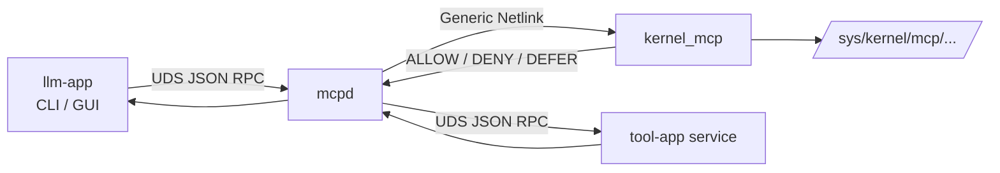
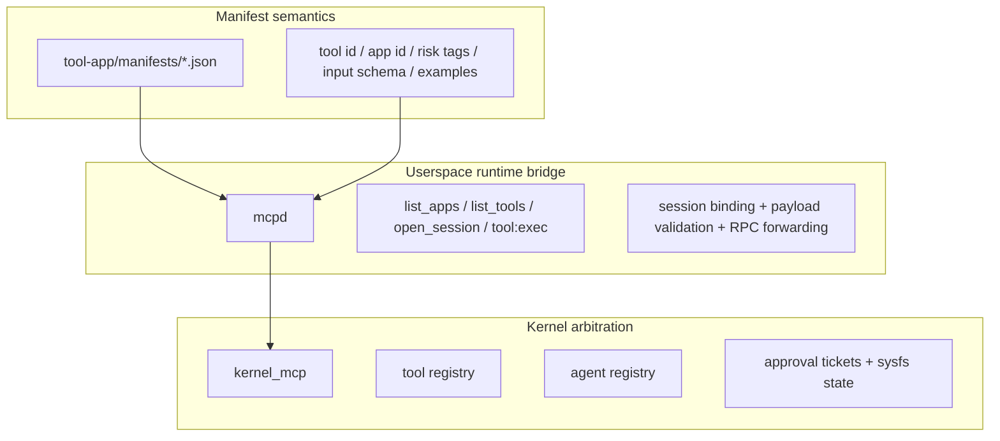
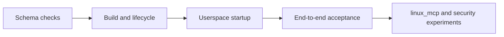
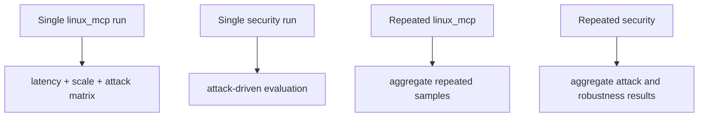

# linux-mcp


`linux-mcp` is a clean-room prototype for a kernel-assisted MCP-style control plane on Linux. It combines:

- a Linux kernel module for control-plane arbitration and state exposure
- a userspace gateway that understands tool semantics and runtime endpoints
- demo tool services exposed over Unix domain sockets
- an LLM-driven CLI and GUI client

The repository is not a phase-based sketch. It is a runnable end-to-end system with a concrete request path, a concrete tool manifest format, and a maintained experiment workflow.

## At a Glance

| Topic | Summary |
|---|---|
| Core idea | Keep execution in userspace, but move control-plane arbitration and durable visibility into the kernel |
| Execution path | `llm-app -> mcpd -> kernel arbitration -> tool-app -> mcpd -> llm-app` |
| Semantic source of truth | `tool-app/manifests/*.json` |
| Runtime gateway | `mcpd` |
| Kernel interface | Generic Netlink + sysfs |
| Main experiments | linux_mcp evaluation and attack-driven security evaluation |
| Retained results | 4 curated snapshots under [`experiment-results/`](/home/lxh/Code/linux-mcp/experiment-results) |

## Highlights

- Kernel-visible control-plane state without moving tool execution into the kernel
- Manifest-driven catalog export through `list_apps` and `list_tools`
- Session binding against real UDS peer credentials
- Approval-gated mediation for risky tools
- Repeated linux_mcp and repeated security campaigns with curated retained artifacts
- Sysfs-backed observability for debugging and post-crash inspection

## Overview

### What this project demonstrates

- Kernel-visible control-plane state for tool mediation
- Userspace execution with kernel-backed arbitration
- Manifest-driven app and tool discovery
- Session binding between a client process and mediated tool requests
- Approval-gated execution for risky tools
- Sysfs visibility for post-mortem inspection and debugging

### What this project does not try to do

- It does not move tool execution into the kernel
- It does not parse JSON in kernel space
- It is not a general policy engine
- It does not claim complete execution security

## Architecture

### End-to-end request path



### Control-plane split



### Request lifecycle

```text
1. mcpd loads tool manifests
2. mcpd registers manifest tools in the kernel
3. llm-app queries list_apps / list_tools
4. llm-app opens a short-lived session
5. mcpd binds the session to UDS peer credentials
6. tool:exec is arbitrated by the kernel
7. mcpd forwards the call to the selected tool-app service
8. completion is reported back to the kernel
9. state remains inspectable through sysfs
```

### Design principles

| Principle | How the repository applies it |
|---|---|
| Kernel is control plane only | No JSON parsing or tool execution in kernel space |
| Userspace owns semantics | `mcpd` loads manifests, validates payloads, and knows endpoints |
| Manifest is authoritative | Tool identity, hash, risk tags, examples, and input schema come from manifests |
| Client is mediated | `llm-app` never talks directly to tool services |
| Observability matters | Agent and tool state remain visible through sysfs |

## Repository Layout

```text
linux-mcp/
├── kernel-mcp/        Linux kernel module and UAPI-facing control-plane logic
├── mcpd/              Userspace gateway, manifest loader, session store, RPC server
├── tool-app/          Demo tool services and manifest definitions
├── llm-app/           CLI and GUI client
├── client/            Schema constants and low-level client/debug helpers
├── scripts/           Build, launch, stop, smoke, acceptance, and experiment entrypoints
├── experiment-results/ Retained final and repeated experiment outputs
└── README.md
```

### Directory guide

| Path | Purpose |
|---|---|
| [kernel-mcp/](/home/lxh/Code/linux-mcp/kernel-mcp) | Kernel module source. Implements Generic Netlink commands, tool and agent state, approval tickets, and sysfs exposure. |
| [mcpd/](/home/lxh/Code/linux-mcp/mcpd) | Control-plane gateway. Loads manifests, reconciles tool state with the kernel, validates requests, and forwards tool RPCs. |
| [tool-app/](/home/lxh/Code/linux-mcp/tool-app) | Demo app backends and manifest files. This repository intentionally treats this directory as the semantic source of truth. |
| [llm-app/](/home/lxh/Code/linux-mcp/llm-app) | User-facing clients. The CLI and GUI both route exclusively through `mcpd`. |
| [client/](/home/lxh/Code/linux-mcp/client) | Shared schema constants and simple helpers for debugging or low-level interaction. |
| [scripts/](/home/lxh/Code/linux-mcp/scripts) | Operational entrypoints for build, launch, smoke checks, acceptance, and experiments. |
| [experiment-results/](/home/lxh/Code/linux-mcp/experiment-results) | Curated experiment artifacts kept in-tree for reference. |

## Component Responsibilities

### `kernel-mcp`

The kernel module is the control-plane enforcement point, not the execution engine.

It currently provides:

- `KERNEL_MCP` Generic Netlink family
- tool registry and agent registry
- approval ticket lifecycle
- binding checks using `binding_hash` and `binding_epoch`
- sysfs state under `/sys/kernel/mcp/tools/` and `/sys/kernel/mcp/agents/`

Current demo arbitration rules are intentionally simple:

- unregistered agents are denied
- manifest hash mismatches are denied
- risky tools are deferred for approval
- other tools are allowed

### `mcpd`

`mcpd` is the only component that understands both tool semantics and runtime endpoints.

It is responsible for:

- loading `tool-app/manifests/*.json`
- computing semantic hashes
- registering tools in the kernel at startup and on manifest refresh
- exposing `/tmp/mcpd.sock`
- binding sessions to UDS peer credentials
- validating payloads before execution
- forwarding tool RPCs to userspace services
- reporting completion back to the kernel

### `tool-app`

`tool-app` contains demo backends and manifest definitions. The README intentionally does not enumerate every app and tool individually; the authoritative semantic catalog lives in `tool-app/manifests/*.json` and is surfaced at runtime through `mcpd`.

### `llm-app`

`llm-app` provides both CLI and GUI frontends.

It does not talk directly to tool services. Instead, it uses:

- `list_apps`
- `list_tools`
- `open_session`
- `tool:exec`

The current planner depends on `DEEPSEEK_API_KEY`.

## Manifest Model

The manifest layer is the semantic source of truth for the system.

### App-level fields

- `app_id`
- `app_name`
- `transport`
- `endpoint`
- `demo_entrypoint`

### Tool-level fields

- `tool_id`
- `name`
- `risk_tags`
- `operation`
- `timeout_ms`
- `description`
- `input_schema`
- `examples`

### Current constraints

- only `transport = "uds_rpc"` is supported
- endpoints must live under `/tmp/linux-mcp-apps/`
- manifest semantics are hashed into the exported tool identity

## Getting Started

### Requirements

| Category | Requirement |
|---|---|
| OS | Linux |
| Build | `bash`, `make`, `gcc`, `python3` |
| Kernel build | headers for `$(uname -r)` at `/lib/modules/$(uname -r)/build` |
| Privileges | root for kernel module load/unload |
| LLM client | `DEEPSEEK_API_KEY` |
| GUI | `PySide6` |

### Quick start

```bash
cd ~/Code/linux-mcp
bash scripts/run_smoke.sh
sudo bash scripts/build_kernel.sh
sudo bash scripts/unload_module.sh || true
sudo bash scripts/load_module.sh
make schema-verify
bash scripts/run_tool_services.sh
bash scripts/run_mcpd.sh
export DEEPSEEK_API_KEY="your_key"
python3 llm-app/cli.py --once "show system info"
```

### Shutdown

```bash
bash scripts/stop_mcpd.sh
bash scripts/stop_tool_services.sh
sudo bash scripts/unload_module.sh
```

### GUI

```bash
cd ~/Code/linux-mcp
source .venv/bin/activate
python llm-app/gui_app.py
```

## Common Commands

| Command | Purpose |
|---|---|
| `bash scripts/run_smoke.sh` | Basic repository and schema smoke checks |
| `make schema-verify` | Verify UAPI and Python schema synchronization |
| `sudo bash scripts/build_kernel.sh` | Build the kernel module |
| `sudo bash scripts/load_module.sh` | Load `kernel_mcp` |
| `sudo bash scripts/unload_module.sh` | Unload `kernel_mcp` |
| `bash scripts/run_tool_services.sh` | Start demo tool services |
| `bash scripts/run_mcpd.sh` | Start `mcpd`, wait for socket readiness, reconcile kernel state |
| `bash scripts/stop_tool_services.sh` | Stop demo tool services |
| `bash scripts/stop_mcpd.sh` | Stop `mcpd` |
| `sudo bash scripts/reload_10x.sh` | Repeated module reload stability check |
| `sudo bash scripts/demo_acceptance.sh` | End-to-end acceptance run |

## Observability

### Kernel state

```bash
ls /sys/kernel/mcp/tools
cat /sys/kernel/mcp/tools/2/name
cat /sys/kernel/mcp/tools/2/hash

ls /sys/kernel/mcp/agents
cat /sys/kernel/mcp/agents/a1/allow
cat /sys/kernel/mcp/agents/a1/defer
cat /sys/kernel/mcp/agents/a1/completed_ok
cat /sys/kernel/mcp/agents/a1/last_reason
cat /sys/kernel/mcp/agents/a1/last_exec_ms
```

### Userspace logs

```bash
cat /tmp/mcpd-$(id -u).log
ls /tmp/linux-mcp-app-*.log
```

## Validation Model

The repository does not currently use a standalone `tests/` tree. Validation is script-driven.



### Main validation entrypoints

| Layer | Command |
|---|---|
| Schema | `python3 scripts/verify_schema_sync.py` |
| Schema | `make schema-verify` |
| Smoke | `bash scripts/run_smoke.sh` |
| Lifecycle | `sudo bash scripts/reload_10x.sh` |
| Acceptance | `sudo bash scripts/demo_acceptance.sh` |
| Experiments | `bash scripts/run_linux_mcp_evaluation.sh` |
| Experiments | `bash scripts/run_security_evaluation.sh` |
| Repeated experiments | `bash scripts/run_repeated_linux_mcp.sh` |
| Repeated experiments | `bash scripts/run_repeated_security.sh` |

## Experiments

Experiment-specific details live in [scripts/experiments/README.md](/home/lxh/Code/linux-mcp/scripts/experiments/README.md). At the repository level, there are four maintained experiment entrypoints:



### Experiment entrypoints

| Command | Scope |
|---|---|
| `bash scripts/run_linux_mcp_evaluation.sh` | Single linux_mcp evaluation |
| `bash scripts/run_security_evaluation.sh` | Single attack-driven security evaluation |
| `bash scripts/run_repeated_linux_mcp.sh` | Repeated linux_mcp runs |
| `bash scripts/run_repeated_security.sh` | Repeated security aggregation |

### Retained result snapshots

Only four curated result sets are kept in-tree:

- [security-final/run-20260404-122908](/home/lxh/Code/linux-mcp/experiment-results/security-final/run-20260404-122908)
- [linux-mcp-smoke/run-20260405-065703](/home/lxh/Code/linux-mcp/experiment-results/linux-mcp-smoke/run-20260405-065703)
- [linux-mcp-smoke2/run-20260405-065804](/home/lxh/Code/linux-mcp/experiment-results/linux-mcp-smoke2/run-20260405-065804)
- [security-repeat/run-20260404-134838](/home/lxh/Code/linux-mcp/experiment-results/security-repeat/run-20260404-134838)

### Result summary

| Evaluation | Main takeaway | Primary artifacts |
|---|---|---|
| Single security | Kernel-backed control-plane checks block the tested spoofing, replay, tampering, and TOCTOU cases in the maintained attack suite. | [security_report.md](/home/lxh/Code/linux-mcp/experiment-results/security-final/run-20260404-122908/security_report.md), [plots](/home/lxh/Code/linux-mcp/experiment-results/security-final/run-20260404-122908/plots) |
| Repeated security | Repeated runs stabilize the same conclusion and quantify semantic recall limits, daemon-crash behavior, and mixed-traffic outcomes. | [repeated_security_report.md](/home/lxh/Code/linux-mcp/experiment-results/security-repeat/run-20260404-134838/aggregate/repeated_security_report.md), [figure_captions.md](/home/lxh/Code/linux-mcp/experiment-results/security-repeat/run-20260404-134838/aggregate/figure_captions.md) |
| Single linux_mcp | The maintained evaluation now centers on A/B/C comparison across latency, scale, and attack outcomes rather than the older composite framing. | [linux_mcp_report.md](/home/lxh/Code/linux-mcp/experiment-results/linux-mcp-smoke2/run-20260405-065804/linux_mcp_report.md), [plots](/home/lxh/Code/linux-mcp/experiment-results/linux-mcp-smoke2/run-20260405-065804/plots) |

### Security claims supported by the current results

- kernel-backed control-plane enforcement is stronger than the equivalent userspace baselines used here
- the maintained kernel path blocks the tested spoofing, replay, tampering, and TOCTOU cases
- kernel-visible approval state survives daemon failure better than the compared userspace baseline

### Claims intentionally not made

- the system is fully secure
- all attacks are prevented
- tool execution itself is kernel-protected

## Limitations

- tool planning and payload construction depend on DeepSeek; there is no offline planner
- kernel policy is a demo policy, not a general authorization framework
- only `uds_rpc` transport is supported
- the data plane still uses framed JSON RPC
- session state is userspace-owned and does not survive daemon restart the way approval state can

## Acceptance Workflow

For the most complete local confidence check:

```bash
sudo bash scripts/demo_acceptance.sh
```

This runs the system through:

1. kernel build and module load
2. client build
3. tool service startup
4. `mcpd` startup
5. DeepSeek-key check
6. two LLM-driven CLI invocations
7. sysfs inspection
8. service shutdown
9. module unload
10. repeated reload validation
