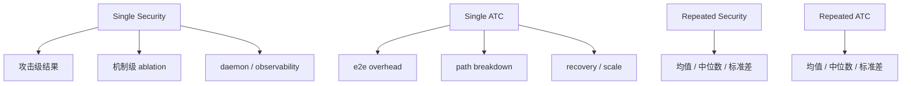

# linux-mcp Experiment Report

## 1. 报告目的

本文档系统说明 `linux-mcp` 当前保留的实验设计、实验脚本、输出产物、结果解读与结论边界。它不重复项目 README 的使用说明，而是聚焦于：

- 实验为什么这样设计
- 每个脚本具体测什么
- 当前保留的正式结果快照在哪里
- 这些结果支持哪些 claim
- 哪些 claim 仍然不能说

当前仓库只保留 4 组正式实验快照：

- [security-final/run-20260404-122908](/home/lxh/Code/linux-mcp/experiment-results/security-final/run-20260404-122908)
- [atc-final/run-20260404-122908](/home/lxh/Code/linux-mcp/experiment-results/atc-final/run-20260404-122908)
- [atc-repeat/run-20260404-124956](/home/lxh/Code/linux-mcp/experiment-results/atc-repeat/run-20260404-124956)
- [security-repeat/run-20260404-134838](/home/lxh/Code/linux-mcp/experiment-results/security-repeat/run-20260404-134838)

## 2. 实验总览

### 2.1 实验结构

### 2.2 实验入口

| 入口 | 作用 | 主要脚本 |
|---|---|---|
| `bash scripts/run_security_evaluation.sh` | 单次 attack-driven 安全评估 | [run_security_evaluation.sh](/home/lxh/Code/linux-mcp/scripts/run_security_evaluation.sh), [security_eval.py](/home/lxh/Code/linux-mcp/scripts/experiments/security_eval.py) |
| `bash scripts/run_atc_evaluation.sh` | 单次综合系统评估 | [run_atc_evaluation.sh](/home/lxh/Code/linux-mcp/scripts/run_atc_evaluation.sh), [atc_eval.py](/home/lxh/Code/linux-mcp/scripts/experiments/atc_eval.py) |
| `bash scripts/run_repeated_security.sh` | 多轮 security 聚合 | [run_repeated_security.sh](/home/lxh/Code/linux-mcp/scripts/run_repeated_security.sh), [aggregate_security_runs.py](/home/lxh/Code/linux-mcp/scripts/experiments/aggregate_security_runs.py), [plot_repeated_security.py](/home/lxh/Code/linux-mcp/scripts/experiments/plot_repeated_security.py) |
| `bash scripts/run_repeated_atc.sh` | 多轮 ATC 聚合 | [run_repeated_atc.sh](/home/lxh/Code/linux-mcp/scripts/run_repeated_atc.sh), [aggregate_atc_runs.py](/home/lxh/Code/linux-mcp/scripts/experiments/aggregate_atc_runs.py), [plot_repeated_atc.py](/home/lxh/Code/linux-mcp/scripts/experiments/plot_repeated_atc.py) |

### 2.3 实验中比较的系统形态

| 模式 | 含义 |
|---|---|
| `direct` | 不经过 `mcpd` kernel 仲裁的直接工具 RPC 基线 |
| `mcpd` | 当前完整路径，含 manifest 语义、session binding、kernel arbitration、tool completion |
| `forwarder_only` | 保留 gateway relay，但基本移除 kernel-backed 语义仲裁 |
| `userspace_semantic_plane` | 在用户态复刻语义检查，不走 kernel control plane |
| `userspace_tamper_*` | 人为关闭某类机制后的 userspace 攻击基线 |
| `userspace_compromised` | 模拟 userspace control plane 被攻破的对照路径 |

## 3. 安全实验

### 3.1 设计目标

安全实验不是 benchmark-driven，而是 attack-driven。目标是回答：

1. 内核持有的 control plane 是否能阻断当前维护的 spoofing、replay、tampering、TOCTOU 攻击。
2. 相同语义若留在 userspace，在哪些地方会失效。
3. daemon 崩溃后，哪些状态仍能保留，哪些状态会丢失。
4. 每个机制是否都有独立贡献。

### 3.2 覆盖内容

当前 [security_eval.py](/home/lxh/Code/linux-mcp/scripts/experiments/security_eval.py) 覆盖 5 类攻击、1 组机制拆解和 1 组可观测性对照：

| 组别 | 内容 |
|---|---|
| A | Identity spoofing：`fake_session_id`、`expired_session`、`session_token_theft` |
| B | Approval replay / forgery：`forged_approval_ticket`、`cross_agent_ticket_reuse`、`cross_tool_ticket_reuse`、`expired_ticket_replay`、`denied_ticket_reuse` |
| C | Semantic tampering：`hash_mismatch`、`wrong_app_binding`、`stale_catalog_replay`，以及离线 benign/adversarial 语义变体评估 |
| D | Daemon compromise：`approval_required_bypass`、`invalid_session_hash_bypass`，以及 daemon crash 状态保持对比 |
| E | TOCTOU：`toctou_hash_mismatch_after_approval`、`toctou_tool_swap_after_approval` |
| Ablation | `agent_binding`、`approval_token`、`semantic_hash`、`kernel_state`、`toctou_binding` |
| Observability | `independent_audit`、`state_introspection`、`post_crash_visibility` |

### 3.3 主要输出

单次 security run 输出：

- `security_summary.json`
- `attack_rows.csv`
- `attack_summary.csv`
- `semantic_tampering.csv`
- `semantic_summary.csv`
- `daemon_compromise.csv`
- `mechanism_ablation.csv`
- `observability.csv`
- `mixed_attack.csv`
- `security_report.md`
- `plots/figure_security_*.png`

对应正式单次结果：

- [security-final/run-20260404-122908](/home/lxh/Code/linux-mcp/experiment-results/security-final/run-20260404-122908)

### 3.4 单次安全实验结果解读

单次结果主报告在 [security_report.md](/home/lxh/Code/linux-mcp/experiment-results/security-final/run-20260404-122908/security_report.md)。

当前最关键的观察是：

- `mcpd` 路径在当前维护的 A/B/C/D/E 攻击集上 `bypass_success_rate = 0`
- 对应的 userspace ablation 一旦移除机制，攻击成功率会明显上升
- semantic fingerprint 结果为：
  - precision = `100%`
  - recall = `66.67%`
  - false_negative_rate = `33.33%`
- daemon crash 对比结果显示：
  - kernel 路径 `approval_state_preserved = 1`
  - kernel 路径 `session_state_preserved = 0`
  - userspace 路径 `approval_state_preserved = 0`

这意味着当前结果支持“kernel-held approval state survives daemon failure better than userspace baseline”，但不支持“所有运行时状态都能恢复”。

## 4. Repeated Security

### 4.1 目的

Repeated security 用于把单次实验变成更稳定的统计证据，输出 mean、median、stdev，而不是只看单轮结果。

### 4.2 聚合输出

正式 repeated security 结果在：

- [security-repeat/run-20260404-134838](/home/lxh/Code/linux-mcp/experiment-results/security-repeat/run-20260404-134838)

核心聚合文件：

- [repeated_security_report.md](/home/lxh/Code/linux-mcp/experiment-results/security-repeat/run-20260404-134838/aggregate/repeated_security_report.md)
- [security_attack_aggregate.csv](/home/lxh/Code/linux-mcp/experiment-results/security-repeat/run-20260404-134838/aggregate/security_attack_aggregate.csv)
- [security_semantic_aggregate.csv](/home/lxh/Code/linux-mcp/experiment-results/security-repeat/run-20260404-134838/aggregate/security_semantic_aggregate.csv)
- [security_daemon_aggregate.csv](/home/lxh/Code/linux-mcp/experiment-results/security-repeat/run-20260404-134838/aggregate/security_daemon_aggregate.csv)
- [security_mixed_aggregate.csv](/home/lxh/Code/linux-mcp/experiment-results/security-repeat/run-20260404-134838/aggregate/security_mixed_aggregate.csv)
- [security_ablation_aggregate.csv](/home/lxh/Code/linux-mcp/experiment-results/security-repeat/run-20260404-134838/aggregate/security_ablation_aggregate.csv)

图和图注：

- [figure_repeated_security_attack_semantic.png](/home/lxh/Code/linux-mcp/experiment-results/security-repeat/run-20260404-134838/aggregate/plots/figure_repeated_security_attack_semantic.png)
- [figure_repeated_security_daemon_mixed.png](/home/lxh/Code/linux-mcp/experiment-results/security-repeat/run-20260404-134838/aggregate/plots/figure_repeated_security_daemon_mixed.png)
- [figure_captions.md](/home/lxh/Code/linux-mcp/experiment-results/security-repeat/run-20260404-134838/aggregate/figure_captions.md)

### 4.3 关键统计结果

Repeated security 当前是 3 轮聚合。主要结论如下：

| 指标 | 结果 |
|---|---|
| `mcpd` 对 A/B/C/D/E 已测攻击的 `bypass_mean` | `0%` |
| `userspace_tamper_approval` 的 replay 攻击 `bypass_mean` | `100%` |
| `userspace_tamper_metadata` 的 tampering 攻击 `bypass_mean` | `100%` |
| semantic precision | `100%` |
| semantic recall | `66.67%` |
| kernel `approval_state_preserved_mean` | `100%` |
| kernel `session_state_preserved_mean` | `0%` |
| userspace `approval_state_preserved_mean` | `0%` |
| mixed traffic 下 `mcpd` 的 `attack_acceptance_mean` | 在 `0/5/10/20%` 恶意流量下都为 `0%` |

### 4.4 这组结果能支持什么

可以支持：

- kernel strengthens control-plane enforcement
- kernel prevents the tested spoofing / replay / tampering / TOCTOU cases
- kernel-held approval state survives daemon failure better than the userspace baseline used here

不能支持：

- “system is secure”
- “prevents all attacks”
- “execution is protected”

## 5. ATC 综合评估

### 5.1 设计目标

ATC 评估不是只测 raw throughput，而是把性能、路径拆解、恢复和扩展性放在一起看。目标是回答：

1. `mcpd` 相对 direct path 的 e2e 开销是多少。
2. 这些开销来自哪里。
3. approval path、deny path、allow path 的延迟结构是什么。
4. daemon restart、tool restart、manifest scale 下系统是否还能工作。

### 5.2 覆盖内容

当前 [atc_eval.py](/home/lxh/Code/linux-mcp/scripts/experiments/atc_eval.py) 覆盖：

| 类别 | 内容 |
|---|---|
| E2E | `direct` vs `mcpd` across multiple concurrency levels |
| Placement ablation | `forwarder_only`、`userspace_semantic_plane` |
| Control plane | `list_apps`、`list_tools`、`open_session` RPC latency |
| Path breakdown | `allow` / `deny` / `defer` path, 包括 arbitration timing |
| Approval | approval path success / deny / session mismatch |
| Recovery | daemon restart recovery, tool-service restart recovery |
| Scale | manifest scale |
| Raw samples | CDF 所需的路径级原始样本 |

### 5.3 主要输出

单次 ATC run 输出：

- `atc_summary.json`
- `atc_report.md`
- `e2e_summaries.csv`
- `variant_summaries.csv`
- `trace_results.csv`
- `policy_mix.csv`
- `control_plane_rpcs.csv`
- `path_breakdown.csv`
- `path_breakdown_raw.csv`
- `approval_path.csv`
- `restart_recovery.csv`
- `tool_service_recovery.csv`
- `manifest_scale.csv`
- `derived_metrics.csv`
- `selected_tools.csv`
- `plots/figure_atc_*.png`

正式单次结果：

- [atc-final/run-20260404-122908](/home/lxh/Code/linux-mcp/experiment-results/atc-final/run-20260404-122908)

### 5.4 单次 ATC 结果解读

主报告在 [atc_report.md](/home/lxh/Code/linux-mcp/experiment-results/atc-final/run-20260404-122908/atc_report.md)。

其中最重要的几项指标是：

| 指标 | 结果 |
|---|---|
| `open_session` p95 | 约 `2.253 ms` |
| `list_apps` p95 | 约 `5.114 ms` |
| `list_tools` p95 | 约 `5.258 ms` |
| `mcpd` allow path arbitration p95 | 约 `0.20 ms` |
| `mcpd` deny path arbitration p95 | 约 `0.085 ms` |
| `mcpd` defer path arbitration p95 | 约 `0.096 ms` |
| daemon restart outage | 约 `105.212 ms` |
| tool-service restart outage | 约 `611.361 ms` |

这说明当前实现不只是“能跑”，而且已经把仲裁、批准、恢复开销分解到了路径级。

## 6. Repeated ATC

### 6.1 目的

Repeated ATC 用于把单次性能测试中的偶发抖动平滑掉，让结论建立在聚合统计而不是单轮样本上。

### 6.2 聚合输出

正式 repeated ATC 结果在：

- [atc-repeat/run-20260404-124956](/home/lxh/Code/linux-mcp/experiment-results/atc-repeat/run-20260404-124956)

核心聚合文件：

- [repeated_atc_report.md](/home/lxh/Code/linux-mcp/experiment-results/atc-repeat/run-20260404-124956/aggregate/repeated_atc_report.md)
- [atc_e2e_aggregate.csv](/home/lxh/Code/linux-mcp/experiment-results/atc-repeat/run-20260404-124956/aggregate/atc_e2e_aggregate.csv)
- [atc_variant_aggregate.csv](/home/lxh/Code/linux-mcp/experiment-results/atc-repeat/run-20260404-124956/aggregate/atc_variant_aggregate.csv)
- [figure_repeated_atc.png](/home/lxh/Code/linux-mcp/experiment-results/atc-repeat/run-20260404-124956/aggregate/plots/figure_repeated_atc.png)
- [figure_captions.md](/home/lxh/Code/linux-mcp/experiment-results/atc-repeat/run-20260404-124956/aggregate/figure_captions.md)

### 6.3 关键统计结果

Repeated ATC 当前也是 3 轮聚合。

| 模式 | 并发 | throughput mean | p95 mean | p99 mean |
|---|---:|---:|---:|---:|
| `direct` | 1 | `645.701` | `7.338 ms` | `15.383 ms` |
| `direct` | 4 | `1316.591` | `15.803 ms` | `32.840 ms` |
| `direct` | 8 | `1882.637` | `16.798 ms` | `27.499 ms` |
| `mcpd` | 1 | `254.769` | `11.750 ms` | `24.291 ms` |
| `mcpd` | 4 | `348.188` | `21.687 ms` | `43.404 ms` |
| `mcpd` | 8 | `447.584` | `35.164 ms` | `48.285 ms` |

Variant 聚合显示：

| variant | 并发 1 throughput | 并发 4 throughput | 并发 8 throughput |
|---|---:|---:|---:|
| `forwarder_only` | `228.803` | `430.501` | `496.341` |
| `userspace_semantic_plane` | `204.231` | `369.137` | `425.371` |

这说明：

- `mcpd` 相比 direct path 存在明确开销
- 但 userspace semantic checks 和 relay 本身已经占掉了很大一部分
- kernel-backed path 的额外成本，比“从 direct 到完整 userspace mediation”这一步更容易解释

## 7. 实验图像与图注

当前仓库里实验图已经按结果目录各自保存，不再使用全局 `plots/`。

| 结果集 | 图目录 |
|---|---|
| Single security | [plots](/home/lxh/Code/linux-mcp/experiment-results/security-final/run-20260404-122908/plots) |
| Single ATC | [plots](/home/lxh/Code/linux-mcp/experiment-results/atc-final/run-20260404-122908/plots) |
| Repeated security | [plots](/home/lxh/Code/linux-mcp/experiment-results/security-repeat/run-20260404-134838/aggregate/plots) |
| Repeated ATC | [plots](/home/lxh/Code/linux-mcp/experiment-results/atc-repeat/run-20260404-124956/aggregate/plots) |

Repeated 结果的图注已独立写入：

- [security figure captions](/home/lxh/Code/linux-mcp/experiment-results/security-repeat/run-20260404-134838/aggregate/figure_captions.md)
- [atc figure captions](/home/lxh/Code/linux-mcp/experiment-results/atc-repeat/run-20260404-124956/aggregate/figure_captions.md)

## 8. 当前实验体系的优点与边界

### 8.1 优点

- 单次实验和 repeated 聚合都已打通
- 安全实验是 attack-driven，不是只看 benchmark
- 机制级 ablation 已加入
- 路径级 timing 已加入
- daemon failure 和 observability 已进入正式实验
- 结果目录与图像目录已经清理，只保留正式快照

### 8.2 边界

- 当前 security 结果仍然是“对已测攻击集”的结论
- semantic tampering 仍有 recall 缺口
- session state 仍是 userspace-owned，不会像 approval state 一样跨 daemon crash 保留
- repeated run 数目前为 3，不是更大规模的长期 campaign

## 9. 建议阅读顺序

如果是第一次接触本项目的实验部分，建议按下面顺序看：

1. 先看 [scripts/experiments/README.md](/home/lxh/Code/linux-mcp/scripts/experiments/README.md)
2. 再看单次安全报告 [security_report.md](/home/lxh/Code/linux-mcp/experiment-results/security-final/run-20260404-122908/security_report.md)
3. 再看 repeated 安全聚合 [repeated_security_report.md](/home/lxh/Code/linux-mcp/experiment-results/security-repeat/run-20260404-134838/aggregate/repeated_security_report.md)
4. 然后看单次 ATC 报告 [atc_report.md](/home/lxh/Code/linux-mcp/experiment-results/atc-final/run-20260404-122908/atc_report.md)
5. 最后看 repeated ATC 聚合 [repeated_atc_report.md](/home/lxh/Code/linux-mcp/experiment-results/atc-repeat/run-20260404-124956/aggregate/repeated_atc_report.md)

