# linux-mcp Experiment Report

## 0. Userspace安全增强说明

### 0.1 seccomp 

seccomp（secure computing mode）是 Linux 的系统调用过滤机制。它本质上通过 BPF 规则限制进程可以调用哪些 syscall、以什么参数调用，用于缩小用户态进程被利用后的能力范围。

在本实验里，seccomp 方案不是单独组件，而是“userspace 控制面 + sandbox + audit logging + stricter checks”的增强形态。

## 1. 当前正式 linux_mcp 综合评估

### 1.1 设计目标

1. 验证内核层面的安全增强需要付出多少 delay/throughput 代价。
2. 验证 kernel 仲裁是否在安全上必须实现，而非 userspace 强化后仍可替代。
3. 判断端到端时延来自 arbitration、session lookup 还是 tool execution。
4. 当前 demo tool 负载下，kernel arbitration 是否会在多 agent、多并发场景下成为 throughput 瓶颈。

### 1.2 覆盖内容

| 类别 | 内容 |
|---|---|
| Latency | 三种形态在 100 B、10 KB、1 MB payload 下的 repeated latency |
| Breakdown | session_lookup、arbitration、tool_exec、total 路径级 timing |
| Throughput | agents={1,5,10,20,50}、concurrency={1,10,50,100} 下的 RPS 与 tail latency |
| Attack resistance | spoof / replay / substitute / escalation 攻击矩阵 |
| Daemon failure | approval state、session state、sysfs 可见性与恢复延迟 |

### 1.3 主要输出

- [linux-mcp-paper-final-n5/run-20260405-173020](experiment-results/linux-mcp-paper-final-n5/run-20260405-173020)

### 1.4 结果解读

这组数据（n=5）的核心结论是：

- 安全上，kernel 方案显著降低绕过面；
- 性能上，userspace 在部分点位更高，但 kernel 的额外代价处于可接受区间；
- 大 payload 下，主瓶颈来自 tool execution，而不是仲裁本身。

#### 1) 延迟：userspace 在小中包略低，kernel 差距小；大包下 kernel 与 userspace 同量级

| Payload | userspace avg (ms) | kernel avg (ms) | seccomp avg (ms) | kernel 相对 userspace |
|---|---:|---:|---:|---:|
| 100 B | 0.764 | 0.787 | 0.778 | +0.023 ms（约 +3.0%） |
| 10 KB | 0.801 | 0.828 | 0.839 | +0.027 ms（约 +3.4%） |
| 1 MB | 7.226 | 6.908 | 9.330 | -0.318 ms（约 -4.4%） |

补充统计：100B 和 10KB 下，kernel vs userspace 的 p95 差异不显著（p=0.526、0.287）。

#### 2) Breakdown：仲裁有成本，但绝对值很小

- kernel arbitration 平均约 0.026 ms（100B/10KB）、0.033 ms（1MB）。
- 1MB 下 tool_exec 占比：userspace 90.001%、kernel 89.444%。

含义：大包场景里端到端时间主要由工具执行路径决定，而不是由仲裁路径决定。

#### 3) 吞吐：userspace 峰值更高，但 kernel 仍在同一数量级

- userspace 范围：1090 到 1219 RPS
- kernel 范围：1003 到 1137 RPS
- seccomp 范围：1020 到 1200 RPS

代表点（1 agent, concurrency=50）：

- userspace = 1215.647 RPS
- kernel = 1096.227 RPS
- seccomp = 1123.547 RPS

含义：userspace 在原始吞吐上更高；但在当前 demo 负载下，kernel 仍维持在约千级 RPS，属于可接受代价。

#### 4) 安全对抗：kernel 在当前攻击集实现 0% bypass

按 attack_matrix 汇总（总尝试 220 次/系统）：

- userspace：success_rate = 90.91%（bypass 200/220）
- seccomp：success_rate = 35.91%（bypass 79/220）
- kernel：success_rate = 0.00%（bypass 0/220）

攻击类型：

- spoof：身份冒充。伪造或窃取 session 身份，冒充合法 agent 发请求。
- replay：重放攻击。拿旧的 approval ticket 在新会话或过期后再次使用。
- substitute：替换攻击。篡改 tool_id、tool_hash 或 app 绑定，让执行语义偏离 manifest。
- escalation：权限提升。试图绕过 approval gate，让低风险入口触发高风险操作。

#### 5) 故障恢复：kernel 能保留 approval state

daemon crash 后：

- approval_state_preserved：kernel=1，userspace=0
- session_state_preserved：kernel=0，userspace=0

说明：kernel 在审批状态一致性方面更稳健。

### 1.5 图表（来自 run-20260405-173020/plots）

#### 延迟与开销

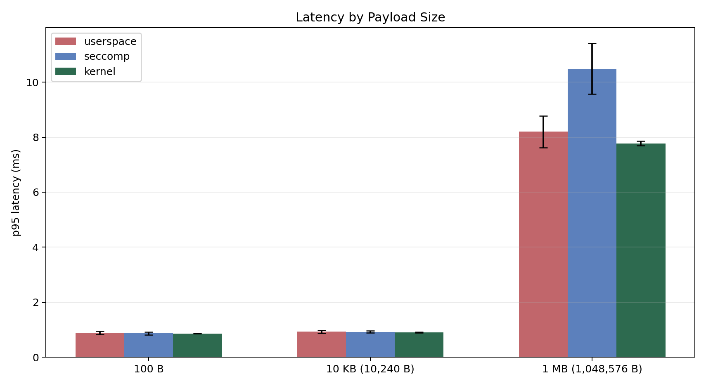

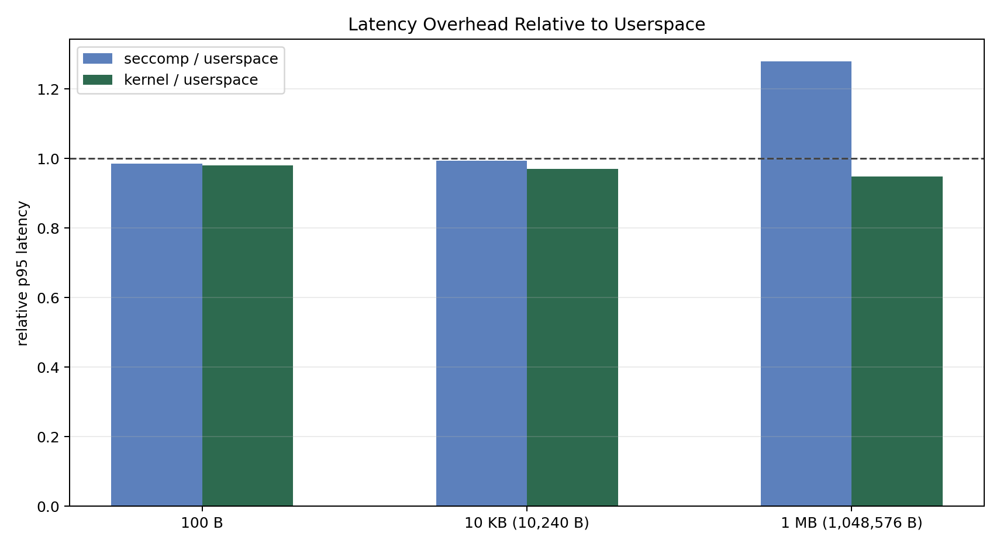

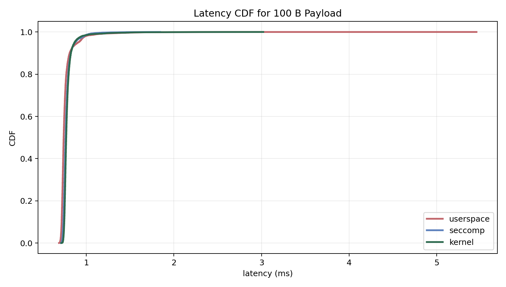

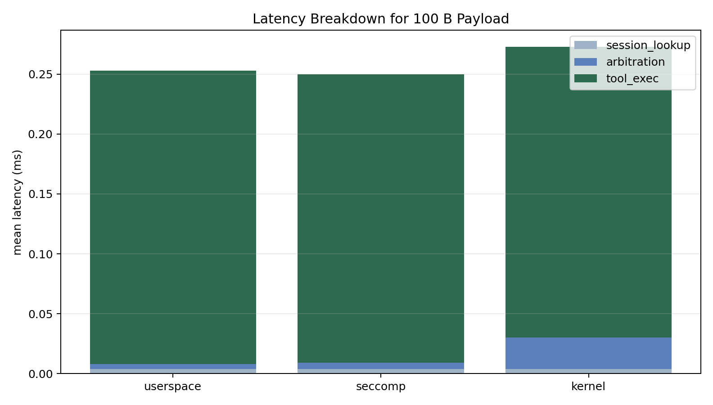

#### 吞吐与安全

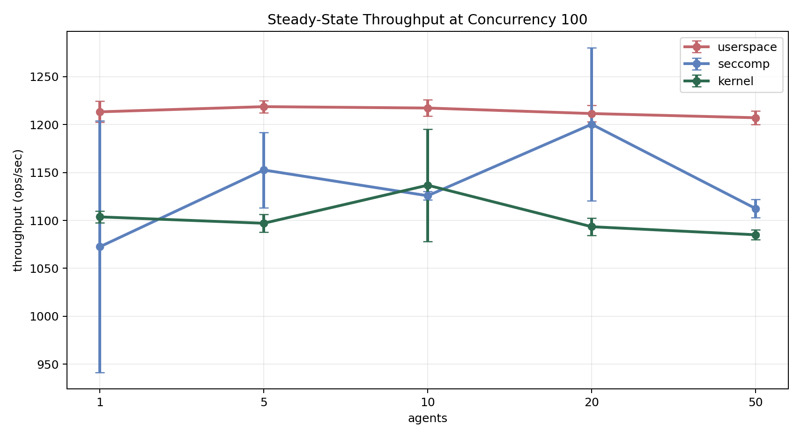

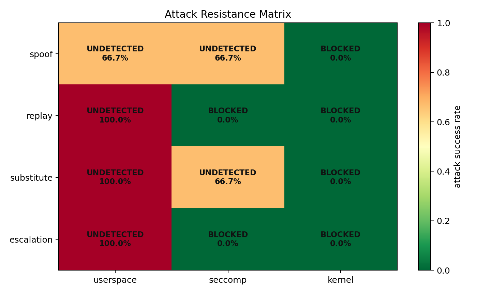

## 2. 补充实验 A：Prompt Injection Runtime Substitution

当前采用的补充安全实验见：

- [semantic-hash-injection-a/run-20260406-111420](experiment-results/semantic-hash-injection-a/run-20260406-111420)

这次结果只保留真实的 `llm-app -> mcpd -> kernel` 执行链

### 2.1 关键结果

| case_id | attempts | planning avg (ms) | kernel block rate |
|---|---:|---:|---:|
| inject_explicit_override | 10 | 8533.095 | 1.000 |
| inject_authority_claim | 10 | 9159.003 | 1.000 |
| inject_catalog_confusion | 10 | 8657.482 | 1.000 |

### 2.2 结果解释

- 证明：在当前 30 次 live planning 中，模型都选择了合法 `notes_app`；而在同一条真实执行链上，只要运行时把 `tool_hash` 替换成 `deadbeef`，kernel 就会以 `DENY + hash_mismatch` 稳定拦截。
- 支撑“runtime semantic-hash substitution 会被 kernel 阻断”

### 2.3 图表

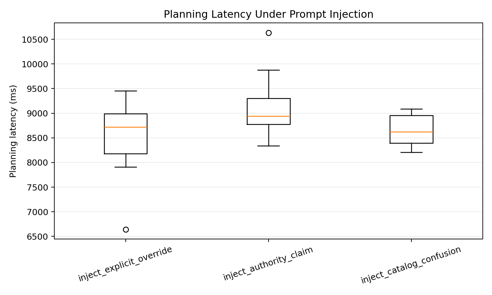

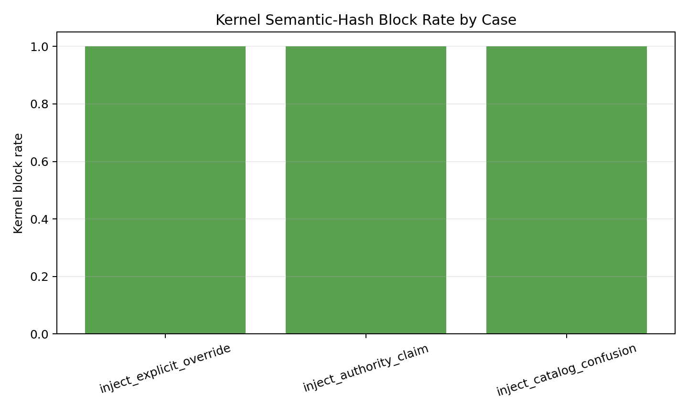

## 3. 补充实验 B：Generic Netlink RTT Microbenchmark

当前采用的 microbenchmark 结果见：

- [netlink-microbench-e/run-20260406-111914](experiment-results/netlink-microbench-e/run-20260406-111914)

### 3.1 关键结果

| mode | avg_ms | p95_ms | p99_ms | std_ms |
|---|---:|---:|---:|---:|
| bare | 0.008196 | 0.010417 | 0.020959 | 0.002594 |
| full | 0.009315 | 0.009750 | 0.020167 | 0.130640 |

- bare：只测最基础的 Generic Netlink 往返，不带完整查找路径
- full：测完整路径，包含额外的 lookup / bookkeeping 开销

派生指标：

- `lookup_overhead_ms = 0.001119`
- `lookup_overhead_share_pct = 12.011%`

### 3.2 结果解释

- 这组数据说明 Generic Netlink 纯往返本身大约在 `8.2 us`，加入完整 lookup/check 后均值约为 `9.3 us`。
- 也就是说，registry lookup 带来的平均增量约为 `1.1 us`，远小于主实验里 `0.022 ms` 量级的固定 kernel overhead。

### 3.3 图表

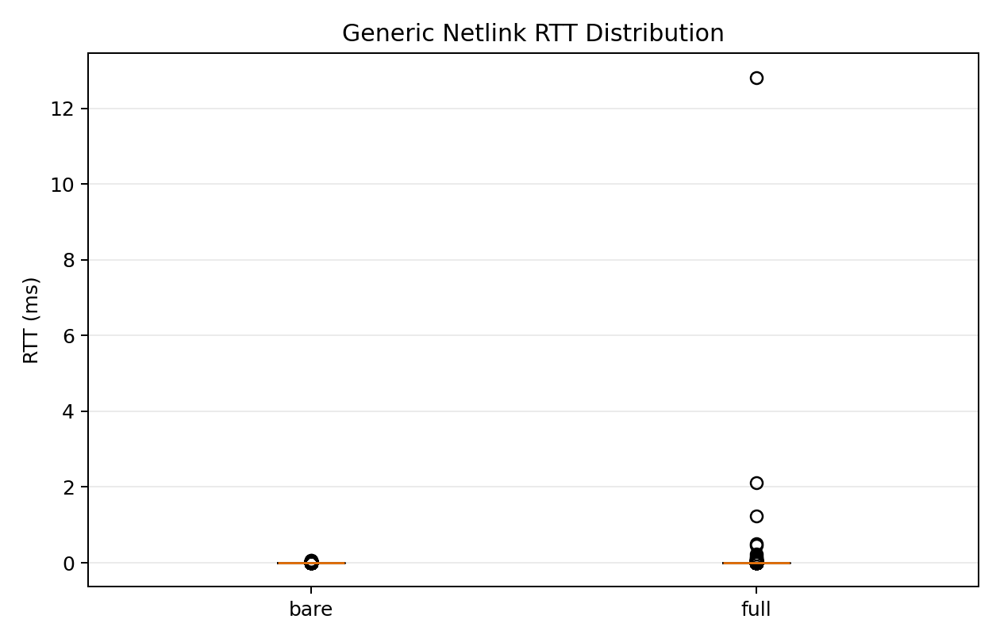

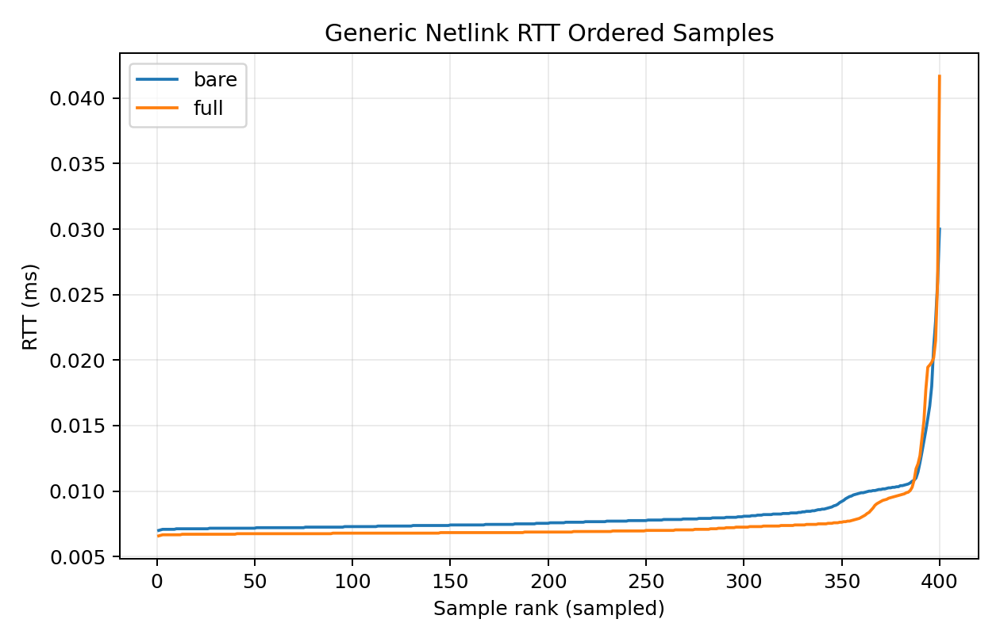

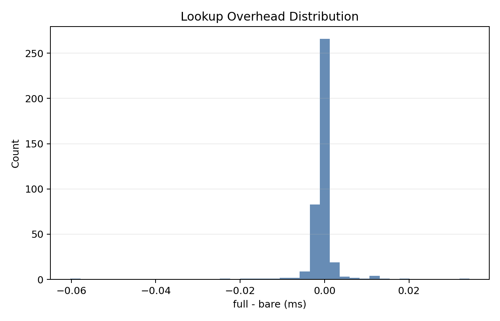

## 4. 当前结果的边界与使用方式

### 4.1 当前结果能支持什么

- small payload 下 kernel arbitration absolute overhead 大约是 0.026 ms。
- small/medium payload 下三种形态端到端延迟差异不显著。
- 1 MB payload 下 seccomp 显著慢于 userspace，而 kernel 与 userspace 没有统计显著差异。
- 当前 demo tool 负载下，三种形态 throughput 大多处于同一数量级，kernel arbitration 未成为硬瓶颈。
- kernel 对当前维护的 spoof/replay/substitute/escalation 攻击集实现了 0% bypass。
- kernel-held approval state 在 daemon crash 后比 userspace baseline 更可保留。
- runtime semantic-hash substitution 在真实 `planning -> execution` 链上可被 kernel 稳定拦截。
- Generic Netlink 往返本身是微秒级；lookup 开销存在，但绝对值很小。

### 4.2 仍需谨慎表达的地方

- 所有 latency/throughput 的 p-value 目前都是“vs userspace”，不能直接替代 kernel vs seccomp 的正式统计检验。
- throughput 表里仍有部分 p-value 缺失，说明不是每个对照点都完成了严格对齐。
- breakdown_summary.csv 是代表性路径分解值，不应直接当成 repeated latency 的总体均值解释。
- 实验环境仍然是 VMware guest，因此必须保留环境声明与噪音控制说明。
- prompt injection 补充实验目前没有证明 planner 已被成功诱导到恶意 app；它证明的是 runtime substitution 的系统级阻断。
- netlink microbenchmark 的 lookup 增量已接近微秒级噪声边界，应避免过度解读单次样本差值。

> All experiments were conducted on a VMware guest (Apple aarch64 host, 4 vCPU, 8 GB RAM). We mitigated hypervisor noise by running experiments in a headless environment with no concurrent user-space workloads.
