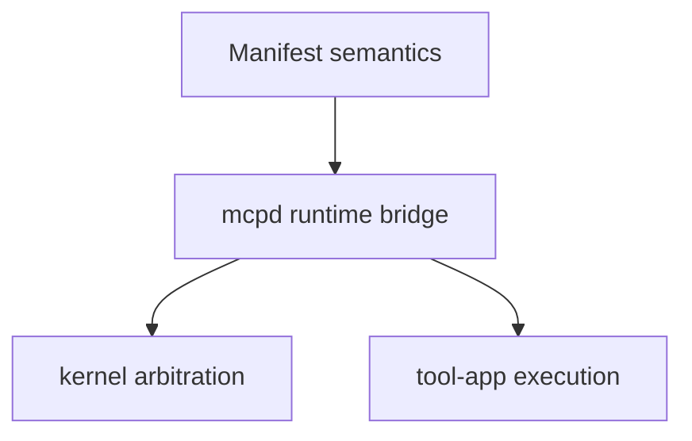
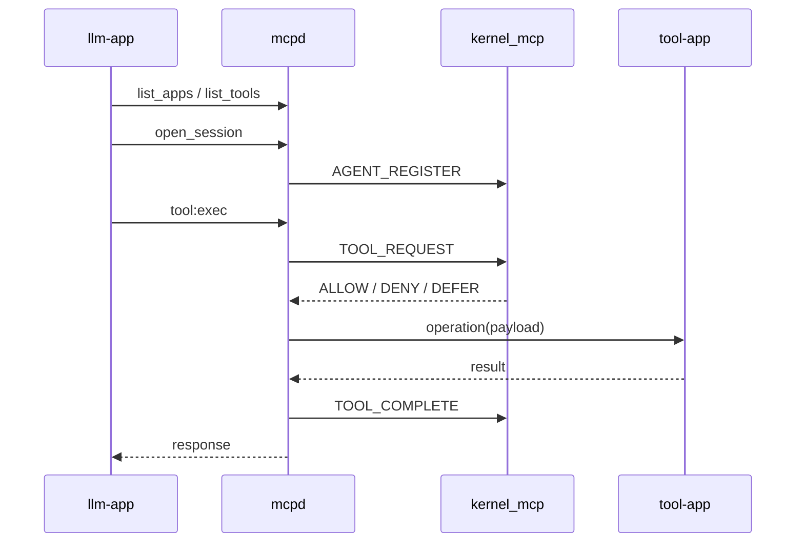

# linux-mcp Report

## 1. 文档目标

本文档从代码实现出发，完整讲清楚 `linux-mcp` 是如何工作的。目标不是介绍“应该怎么设计”，而是解释“当前这份代码实际上怎么实现”。

如果你希望完全掌握这个项目，建议把这份文档和以下代码文件配合阅读：

- [kernel-mcp/src/kernel_mcp_main.c](/home/lxh/Code/linux-mcp/kernel-mcp/src/kernel_mcp_main.c)
- [mcpd/server.py](/home/lxh/Code/linux-mcp/mcpd/server.py)
- [mcpd/session_store.py](/home/lxh/Code/linux-mcp/mcpd/session_store.py)
- [mcpd/manifest_loader.py](/home/lxh/Code/linux-mcp/mcpd/manifest_loader.py)
- [mcpd/netlink_client.py](/home/lxh/Code/linux-mcp/mcpd/netlink_client.py)
- [llm-app/app_logic.py](/home/lxh/Code/linux-mcp/llm-app/app_logic.py)
- [tool-app/demo_rpc.py](/home/lxh/Code/linux-mcp/tool-app/demo_rpc.py)

## 2. 系统的核心思想

### 2.1 一句话概括

`linux-mcp` 把“工具执行”放在用户态，把“工具控制面仲裁与状态可见性”放在内核。

### 2.2 三层分工

这三层分别负责：

| 层 | 负责内容 | 不负责内容 |
|---|---|---|
| Manifest 语义层 | 工具身份、风险标签、描述、输入 schema、示例 | 运行时仲裁 |
| `mcpd` 桥接层 | session、payload 校验、catalog 暴露、工具转发 | 内核 sysfs 状态保存 |
| Kernel 仲裁层 | agent/tool registry、approval ticket、binding 校验、sysfs 可见性 | JSON 解析、工具执行 |

## 3. 一次请求到底怎么走

### 3.1 高层路径

### 3.2 更细一点的执行过程

1. `mcpd` 启动时读取 `tool-app/manifests/*.json`。
2. `mcpd` 为每个工具计算 semantic hash，并把工具注册到内核。
3. `llm-app` 通过 `list_apps` / `list_tools` 获取公开 catalog。
4. `llm-app` 调用 `open_session`，`mcpd` 从 UDS peer credentials 识别真实 `pid/uid/gid`。
5. `mcpd` 为这个 peer 生成 `session_id`、`agent_id`、`binding_hash`、`binding_epoch`。
6. `llm-app` 发 `tool:exec`。
7. `mcpd` 校验 session 是否仍绑定到同一个 peer。
8. `mcpd` 调用内核 `TOOL_REQUEST` 做仲裁。
9. 如果 `ALLOW`，`mcpd` 把请求转发到具体 tool-app 的 UDS endpoint。
10. tool-app 返回结果后，`mcpd` 上报 `TOOL_COMPLETE`。
11. agent/tool 状态通过 `/sys/kernel/mcp/...` 保留和暴露。

## 4. 代码目录如何对应功能

### 4.1 总图

| 路径 | 作用 |
|---|---|
| [kernel-mcp/](/home/lxh/Code/linux-mcp/kernel-mcp) | 内核模块实现 |
| [mcpd/](/home/lxh/Code/linux-mcp/mcpd) | 用户态网关和 runtime |
| [tool-app/](/home/lxh/Code/linux-mcp/tool-app) | demo 工具服务和 manifest |
| [llm-app/](/home/lxh/Code/linux-mcp/llm-app) | CLI/GUI 与 LLM 规划逻辑 |
| [client/](/home/lxh/Code/linux-mcp/client) | 协议常量与辅助代码 |
| [scripts/](/home/lxh/Code/linux-mcp/scripts) | 启停、验证、实验脚本 |

### 4.2 最值得先读的文件

| 文件 | 为什么重要 |
|---|---|
| [mcpd/server.py](/home/lxh/Code/linux-mcp/mcpd/server.py) | 这是整个用户态控制面的中心 |
| [kernel_mcp_main.c](/home/lxh/Code/linux-mcp/kernel-mcp/src/kernel_mcp_main.c) | 内核态 registry、approval、sysfs、genetlink 都在这里 |
| [manifest_loader.py](/home/lxh/Code/linux-mcp/mcpd/manifest_loader.py) | 工具语义是怎么被解析和哈希的 |
| [session_store.py](/home/lxh/Code/linux-mcp/mcpd/session_store.py) | session / binding / pending approval 的核心状态 |
| [app_logic.py](/home/lxh/Code/linux-mcp/llm-app/app_logic.py) | LLM 是怎么从 catalog 构建并执行计划的 |

## 5. Manifest 语义层

### 5.1 manifest 是单一语义来源

当前系统里，工具的“语义身份”不是由 kernel 直接维护，而是由 manifest 决定，再同步到 kernel。

这个过程主要在 [manifest_loader.py](/home/lxh/Code/linux-mcp/mcpd/manifest_loader.py) 中完成。

### 5.2 `ToolManifest` / `AppManifest`

这里定义了两个核心 dataclass：

- `ToolManifest`
- `AppManifest`

它们把 JSON manifest 解析成运行时对象，供 `mcpd`、reconcile 和 public catalog 复用。

### 5.3 semantic hash 是怎么来的

`manifest_loader.py` 中的 `SEMANTIC_HASH_FIELDS` 明确规定了哪些字段参与工具语义哈希，包括：

- `tool_id`
- `name`
- `app_id`
- `app_name`
- `risk_tags`
- `description`
- `input_schema`
- `examples`
- `path_semantics`
- `approval_policy`

`_semantic_hash()` 对这些字段做 canonical JSON 序列化后再做 SHA-256，最后截断为 8 位十六进制。这意味着：

- 运行时 endpoint 不参与工具语义身份
- 改语义字段会改 hash
- kernel 注册态和 userspace manifest 可以用 hash 对齐

### 5.4 manifest 加载过程

`load_app_manifest()` 负责：

- 校验 app 级字段存在
- 限制 `transport == "uds_rpc"`
- 限制 endpoint 必须位于 `/tmp/linux-mcp-apps/`
- 校验 tool 列表非空
- 校验 tool_id 和 name 在 app 内不重复
- 归一化 `risk_tags`、`path_semantics`、`approval_policy`

## 6. `mcpd`：整个系统的用户态中心

### 6.1 它为什么最关键

`mcpd` 是唯一同时理解两件事的进程：

1. 工具语义是什么
2. 工具运行时 endpoint 在哪里

所以它天然处在“语义层”和“执行层”的中间。

### 6.2 全局状态

[mcpd/server.py](/home/lxh/Code/linux-mcp/mcpd/server.py) 顶部维护了几类全局状态：

- `_app_registry`
- `_tool_registry`
- `_registered_agents`
- `_agent_bindings`
- `_userspace_approval_tickets`
- `_userspace_agent_stats`
- `_kernel_client`

这些状态分别服务于：

- manifest registry
- kernel registration / agent registration
- userspace semantic baseline 与攻击实验
- runtime routing

### 6.3 它暴露的 RPC

当前对外主要暴露 4 类调用：

| 请求 | 作用 |
|---|---|
| `{"sys":"list_apps"}` | 返回 app public catalog |
| `{"sys":"list_tools"}` | 返回 tools public catalog |
| `{"sys":"open_session"}` | 建立短期 session |
| `{"kind":"tool:exec"}` | 执行具体工具 |

此外还支持：

- `{"sys":"approval_decide", ...}`

### 6.4 关键函数

以下函数最值得重点读：

| 函数 | 作用 |
|---|---|
| `_call_tool_service()` | 根据工具 transport 调用具体 tool service |
| `_approval_decide()` | 把 approval 决策路由到 kernel 或 userspace baseline |
| `_handle_tool_exec()` | 整个执行路径的核心入口 |
| `_handle_sys_list_apps()` | 返回 app catalog |
| `_handle_sys_list_tools()` | 返回 tool catalog |
| `_handle_sys_open_session()` | 创建 session 并绑定 agent |
| `_handle_sys_approval_decide()` | 处理批准请求 |
| `_handle_connection()` | UDS 连接入口 |

### 6.5 `tool:exec` 到底做了什么

`_handle_tool_exec()` 是全项目最关键的单个函数之一。它做的事情按顺序是：

1. 解析请求和 peer identity
2. 解析并校验 session
3. 根据 session 生成 `AgentBinding`
4. 从 registry 找到目标工具
5. 按 manifest `input_schema` 校验 payload
6. 解析 tool hash
7. 确保 agent 已经注册到 kernel
8. 调用 `_kernel_arbitrate()` 做仲裁
9. 如果 `DENY` 或 `DEFER`，直接构造错误响应
10. 如果 `ALLOW`，调用 `_call_tool_service()`
11. 最后上报 `_kernel_report_complete()`

这就是为什么 `mcpd` 是“控制面桥接层”，而不是单纯的 RPC proxy。

### 6.6 timing 是怎么测的

实验里用到的路径级 timing 也是在 `server.py` 里完成的。

当 `MCPD_TRACE_TIMING=1` 时，`_handle_tool_exec()` 会把以下 timing 写回响应：

- `session_lookup`
- `arbitration`
- `tool_exec`
- `total`

旧的路径分解实验正是利用这一点。

## 7. Session 与 Agent Binding

### 7.1 session 的真实含义

session 不是一个抽象 token，而是：

- 一个随机生成的 `session_id`
- 一个与 peer identity 绑定的 `agent_id`
- 一个 `binding_hash`
- 一个单调增加的 `binding_epoch`

这些都定义在 [session_store.py](/home/lxh/Code/linux-mcp/mcpd/session_store.py)。

### 7.2 `open_session()`

`open_session()` 会：

1. 清理过期 session
2. 生成随机 `session_id`
3. 生成新的 `agent_id`
4. 生成 `binding_epoch`
5. 用 `uid/gid/pid/session_id` 计算 `binding_hash`
6. 把 session 放进 `_sessions`

### 7.3 为什么要有 binding hash / epoch

这是整个项目抗 spoofing / replay / TOCTOU 的关键之一。

- `binding_hash` 把 session 和真实 UDS peer 绑定在一起
- `binding_epoch` 给 binding 一个版本号
- approval ticket 也会绑定这两项

因此，当前设计不是“有 session_id 就行”，而是“session_id + 当前 peer + binding metadata 一起成立才行”。

### 7.4 pending approval 存的是什么

`remember_pending_approval()` 保存：

- `session_id`
- `req_id`
- `agent_id`
- `binding_hash`
- `binding_epoch`
- `app_id`
- `tool_id`
- `payload`
- `tool_hash`

这就是 approval replay 和 TOCTOU 能被识别的基础。

## 8. Kernel 模块实现

### 8.1 内核模块维护哪些对象

在 [kernel_mcp_main.c](/home/lxh/Code/linux-mcp/kernel-mcp/src/kernel_mcp_main.c) 中，最重要的 3 类对象是：

- `kernel_mcp_tool`
- `kernel_mcp_agent`
- `kernel_mcp_approval_ticket`

对应到系统语义分别是：

- 工具注册表项
- agent 状态项
- approval ticket 状态项

### 8.2 存储结构

内核里用了两类容器：

- `xarray` 保存 tools
- `hashtable` 保存 agents 和 approval tickets

这也是为什么 tool lookup 和 agent lookup 的路径是不同的。

### 8.3 sysfs

sysfs 目录树分成：

- `/sys/kernel/mcp/tools/<tool_id>/`
- `/sys/kernel/mcp/agents/<agent_id>/`

这部分由：

- `kernel_mcp_tool_sysfs_create()`
- `kernel_mcp_agent_sysfs_create()`
- 一组 snapshot + show helper

共同实现。

### 8.4 approval ticket 生命周期

approval ticket 由 `TOOL_REQUEST` 产生，由 `APPROVAL_DECIDE` 更新，并由：

- `decided`
- `approved`
- `consumed`
- `expires_jiffies`

这些字段控制生命周期。

内核还维护了 ticket cleanup timer，用于清理过期条目。

### 8.5 关键 Generic Netlink 命令

内核侧最重要的命令处理函数有：

| 函数 | 作用 |
|---|---|
| `kernel_mcp_cmd_tool_register()` | 注册工具 |
| `kernel_mcp_cmd_agent_register()` | 注册 agent |
| `kernel_mcp_cmd_tool_request()` | 执行前仲裁 |
| `kernel_mcp_cmd_tool_complete()` | 执行完成回报 |
| `kernel_mcp_cmd_approval_decide()` | 批准 / 拒绝 approval ticket |
| `kernel_mcp_cmd_reset_tools()` | 重置工具注册表 |
| `kernel_mcp_cmd_list_tools_dump()` | dump 工具表 |

### 8.6 当前仲裁规则

`kernel_mcp_cmd_tool_request()` 目前实现的是 demo 规则，而不是通用策略引擎：

- agent 未注册，拒绝
- tool 不存在，拒绝
- tool hash 不一致，拒绝
- binding mismatch，拒绝
- 高风险 flags 命中 approval gate，则 `DEFER`
- 其他情况 `ALLOW`

## 9. Kernel/Userspace 协议是怎么同步的

### 9.1 Python 和 C 共用一份协议定义

Python 侧的常量在 [client/kernel_mcp/schema.py](/home/lxh/Code/linux-mcp/client/kernel_mcp/schema.py)，C 侧的定义在：

- `kernel-mcp/include/uapi/linux/kernel_mcp_schema.h`

### 9.2 同步校验

[verify_schema_sync.py](/home/lxh/Code/linux-mcp/scripts/verify_schema_sync.py) 会同时解析 C header 和 Python 文件，并验证：

- family name
- family version
- command 常量
- attribute 常量

这是协议改动时最重要的防线之一。

## 10. Generic Netlink 用户态客户端

### 10.1 `KernelMcpNetlinkClient`

[mcpd/netlink_client.py](/home/lxh/Code/linux-mcp/mcpd/netlink_client.py) 实现了一个持久化 Generic Netlink client。

它自己做了：

- family id 解析
- netlink header 构造
- attribute 编码/解码
- 单响应请求
- dump 请求

### 10.2 为什么不用 subprocess

这个实现不是通过 shell 命令或外部工具操作 netlink，而是在 Python 内直接构造 netlink 消息，减少了额外进程和格式转换。

## 11. `tool-app` 执行层

### 11.1 执行层协议

所有 demo tool 服务都使用 [tool-app/demo_rpc.py](/home/lxh/Code/linux-mcp/tool-app/demo_rpc.py) 提供的统一协议。

协议很简单：

- 使用 Unix domain socket
- 使用 4-byte big-endian length prefix framing
- body 是 JSON

framing helper 和 `mcpd` 侧复用同一套 [rpc_framing.py](/home/lxh/Code/linux-mcp/mcpd/rpc_framing.py)。

### 11.2 `serve()`

`demo_rpc.py` 的 `serve()` 会：

1. 读取 manifest 拿到 endpoint
2. 创建 UDS socket
3. 对每个连接开线程
4. 解析 `operation` 和 `payload`
5. 调用具体 handler
6. 返回 `status/result/error/t_ms`

这意味着 tool-app 本身非常薄，重点是统一 RPC 形状，而不是复杂框架。

## 12. `llm-app` 是怎么规划和执行的

### 12.1 catalog 获取

[llm-app/app_logic.py](/home/lxh/Code/linux-mcp/llm-app/app_logic.py) 中：

- `load_apps()`
- `load_tools()`
- `load_catalog()`

负责从 `mcpd` 取回 public catalog。

### 12.2 规划

`build_execution_plan()` 会：

1. 先用模型从 tool catalog 中选一批 candidate tools
2. 再让模型输出多步 plan
3. 再把 plan 规范化成 `PlannedStep`

所以当前实现不是“规则路由”，而是“catalog-driven + model-chosen plan”。

### 12.3 payload 生成

`build_payload_for_step()` 会把：

- 用户输入
- 工具 schema
- 示例
- seed payload

一起喂给模型，然后验证返回 payload 是否满足 schema。

### 12.4 执行

`execute_plan()` 是 `llm-app` 的主执行入口。它会：

1. 生成 plan
2. 为每步 materialize payload
3. 调用 `_execute_step_with_approvals()`
4. 在必要时触发 approval handler
5. 保存 step 结果供后续 step 引用
6. 处理 no-match fallback

这就是为什么 `llm-app` 既是 planner，也是 mediated executor。

## 13. 启动与运行脚本

### 13.1 `run_mcpd.sh`

[scripts/run_mcpd.sh](/home/lxh/Code/linux-mcp/scripts/run_mcpd.sh) 不只是简单启动进程。它还会：

- 检查 `kernel_mcp` 模块是否已加载
- 检查 `/sys/kernel/mcp/tools` 和 `/sys/kernel/mcp/agents` 是否存在
- 判断已运行的 `mcpd` catalog 是否过期
- 等待 `/tmp/mcpd.sock` ready
- 调用 reconcile，把 manifest tools 同步到 kernel

### 13.2 reconcile

[reconcile_kernel.py](/home/lxh/Code/linux-mcp/mcpd/reconcile_kernel.py) 会：

1. 读取 manifests
2. `RESET_TOOLS`
3. 重新注册每个 tool
4. dump kernel tool table
5. 校验 kernel registry 与 manifest 一致

### 13.3 为什么这个启动流程重要

这保证了当前系统不是“用户态和内核态可能漂移”的松散 demo，而是启动后强制对齐一次状态。

## 14. 实验代码与主系统的关系

实验并不是另一个系统，而是对当前系统做不同模式的驱动。

例如：

- `forwarder_only`
- `userspace_semantic_plane`
- `userspace_tamper_*`

这些都不是独立二进制，而是通过 `mcpd/server.py` 中的实验模式和 attack profile 控制出来的。

这很重要，因为实验比较的是“同一份系统代码中的机制位置和机制开关”，而不是两个完全不同的实现。

## 15. 这个项目最值得掌握的 5 个实现点

如果你想真正掌握这个项目，最核心的是吃透下面 5 件事：

### 15.1 manifest hash

工具身份不是 endpoint，不是名字字符串，而是“语义字段的 canonical hash”。

### 15.2 session binding

session 不是孤立 token，而是绑定到实际 UDS peer identity。

### 15.3 kernel approval ticket

approval 不是 UI 提示，而是 kernel-visible、可绑定 agent 的状态对象。

### 15.4 `mcpd` 是桥，而不是 proxy

它做 schema 验证、session 验证、catalog 暴露、approval 绑定、tool completion 回报，所以它是 runtime control-plane gateway。

### 15.5 sysfs 不是附属品

sysfs 是当前系统 observability 的重要组成部分，也是 daemon failure 实验能成立的基础。

## 16. 建议的阅读顺序

如果你要从代码角度完全掌握项目，建议按这个顺序读：

1. 先看 [README.md](/home/lxh/Code/linux-mcp/README.md)
2. 再看 [manifest_loader.py](/home/lxh/Code/linux-mcp/mcpd/manifest_loader.py)
3. 再看 [session_store.py](/home/lxh/Code/linux-mcp/mcpd/session_store.py)
4. 然后重点读 [server.py](/home/lxh/Code/linux-mcp/mcpd/server.py)
5. 再读 [kernel_mcp_main.c](/home/lxh/Code/linux-mcp/kernel-mcp/src/kernel_mcp_main.c)
6. 再读 [app_logic.py](/home/lxh/Code/linux-mcp/llm-app/app_logic.py)
7. 最后读 [scripts/experiments/README.md](/home/lxh/Code/linux-mcp/scripts/experiments/README.md) 和实验报告

按这个顺序，你会先建立“语义 -> session -> 仲裁 -> 执行 -> 实验”的完整脑图。
