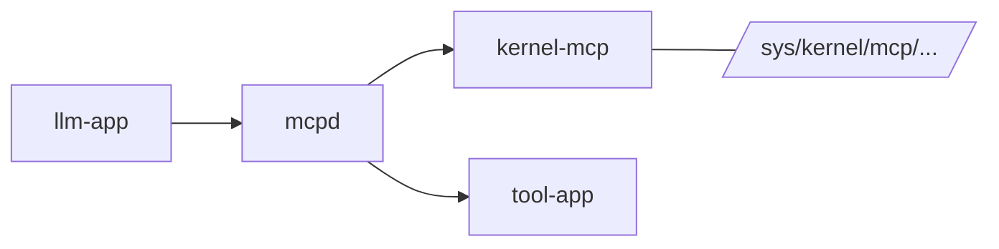
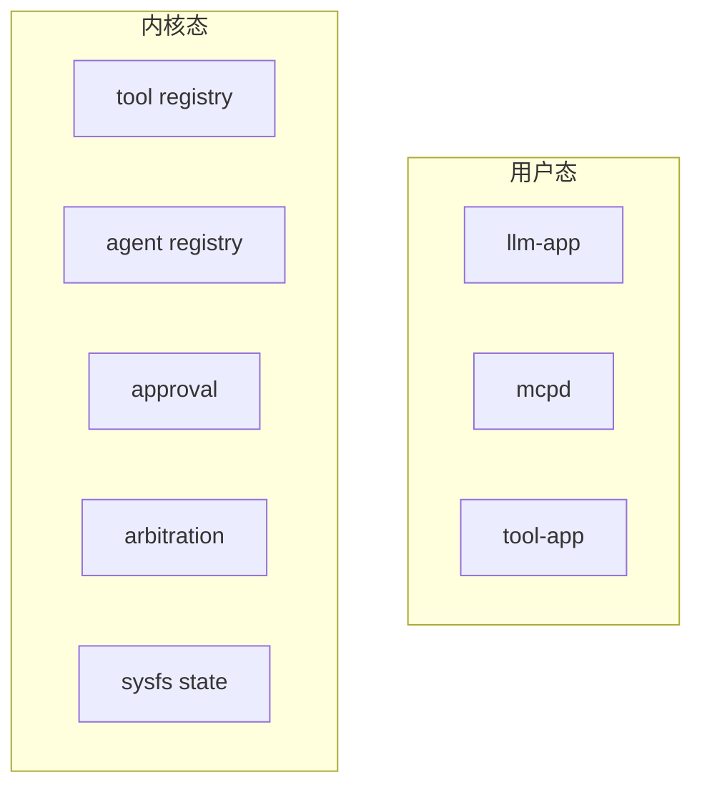
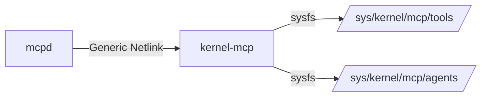
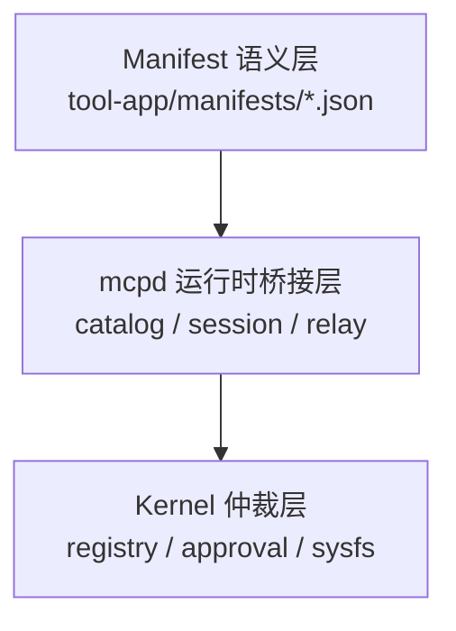
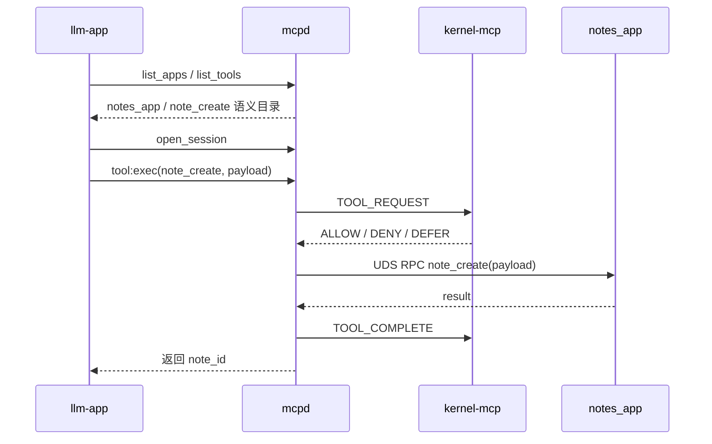
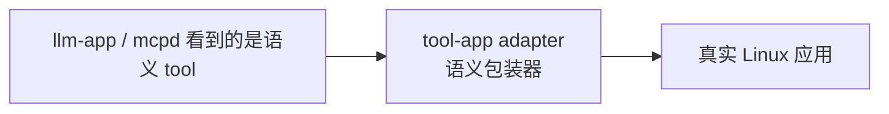

# linux-mcp 演示讲义

## 1. 项目实现什么


`linux-mcp` 是一套 **Kernel-assisted MCP 系统**：

- 工具执行留在用户态
- 工具控制面进入内核

这个项目**不是**把工具执行放进内核，也**不是**让内核理解完整 JSON 语义，而是把下面这些控制面能力放进内核：

- tool 注册状态
- agent 注册状态
- allow / deny / defer 仲裁
- approval ticket
- sysfs 状态暴露

### 为什么这么做

如果一个工具系统完全只放在用户态，会有如下问题：

1. 控制面状态主要存在于 daemon 内存里，工具调用可以直接绕过daemon，或者可以fork一个新进程
2. 全局策略规则不一致，无法做到系统统一调度
3. 工具注册、agent pid绑定无法实现、审批状态缺少统一的系统级可观测面，容易被proxy，中转，或重放
4. 无法做可信记录，日志可以被轻易篡改

这个项目要解决的问题是：

> 能不能把“控制面”做成内核可见、可检查、可仲裁的系统状态，同时又不把复杂工具执行逻辑带进内核？

答案就是这套架构：



## 2. 重点和创新点


### 创新点 1：控制面和执行面显式分离


- 内核只做 control plane
- 用户态继续负责语义和执行

这让系统边界非常明确：



对应代码：

- manifest 加载：[mcpd/manifest_loader.py](/Users/lixiheng/Code/linux_mcp/mcpd/manifest_loader.py)
- 网关主逻辑：[mcpd/server.py](/Users/lixiheng/Code/linux_mcp/mcpd/server.py)
- 内核主逻辑：[kernel_mcp_main.c](/Users/lixiheng/Code/linux_mcp/kernel-mcp/src/kernel_mcp_main.c)

### 创新点 2：用 manifest 统一描述工具语义

这个项目没有把 tool 信息硬编码在客户端里，而是把语义来源统一放在 manifest。

但这里要分清两层：

- app 级字段
- tool 级字段

当前 manifest 顶层实际描述的是：

- `app_id`
- `app_name`
- `transport`
- `endpoint`
- `demo_entrypoint`
- `tools`

当前 `tools[]` 里每个 tool 实际描述的是：

- `tool_id`
- `name`
- `risk_tags`
- `operation`
- `timeout_ms`
- `description`
- `input_schema`
- `examples`
- `path_semantics`（可选）
- `approval_policy`（可选）

如果只讲“tool 语义字段”，更准确的说法是：

- `tool_id`
- `name`
- `app_id`
- `app_name`
- `risk_tags`
- `description`
- `input_schema`
- `examples`
- `path_semantics`
- `approval_policy`

这些字段对应 [mcpd/manifest_loader.py](/Users/lixiheng/Code/linux_mcp/mcpd/manifest_loader.py) 里的 `SEMANTIC_HASH_FIELDS`，会参与 `manifest_hash` 计算。

而运行时接入字段主要是：

- `transport`
- `endpoint`
- `operation`
- `timeout_ms`
- `demo_entrypoint`

对应代码：

- manifest 解析：[mcpd/manifest_loader.py](/Users/lixiheng/Code/linux_mcp/mcpd/manifest_loader.py)
- 对外导出 catalog：[mcpd/public_catalog.py](/Users/lixiheng/Code/linux_mcp/mcpd/public_catalog.py)
- `llm-app` 读取 catalog：[llm-app/app_logic.py](/Users/lixiheng/Code/linux_mcp/llm-app/app_logic.py)


> `llm-app` 不需要知道某个 tool 的内部实现，只需要得到 `mcpd` 导出的语义目录。

### 创新点 3：内核维护控制面状态，并通过 Netlink + sysfs 对外工作

这里有两个关键接口：

- **Netlink**：`mcpd` 和内核之间发控制命令
- **sysfs**：把内核中的控制面状态暴露出来



对应代码：

- Netlink 协议定义：[kernel_mcp_schema.h](/Users/lixiheng/Code/linux_mcp/kernel-mcp/include/uapi/linux/kernel_mcp_schema.h)
- Python Netlink client：[mcpd/netlink_client.py](/Users/lixiheng/Code/linux_mcp/mcpd/netlink_client.py)
- sysfs / registry / 仲裁实现：[kernel_mcp_main.c](/Users/lixiheng/Code/linux_mcp/kernel-mcp/src/kernel_mcp_main.c)

## 3. 这些重点是怎么实现的

可以把实现讲成“三层一条链路”。

### 三层结构



### 每层分别做什么

#### 1. Manifest 语义层

负责定义：

- tool 是什么
- tool 怎么给 LLM 看
- tool 的风险和输入格式是什么

关键代码：

- [01_notes_app.json](/Users/lixiheng/Code/linux_mcp/tool-app/manifests/01_notes_app.json)
- [mcpd/manifest_loader.py](/Users/lixiheng/Code/linux_mcp/mcpd/manifest_loader.py)

#### 2. `mcpd` 运行时桥接层

负责：

- 启动时加载 manifest
- 把 tool 注册到内核
- 暴露 `list_apps` / `list_tools` / `open_session` / `tool:exec`
- 校验 payload
- 把请求转发给 tool service

关键代码：

- `list_apps` / `list_tools`：[mcpd/server.py:880](/Users/lixiheng/Code/linux_mcp/mcpd/server.py#L880)
- `open_session`：[mcpd/server.py:907](/Users/lixiheng/Code/linux_mcp/mcpd/server.py#L907)
- `tool:exec` 主流程：[mcpd/server.py:704](/Users/lixiheng/Code/linux_mcp/mcpd/server.py#L704)
- 调用 tool service：[mcpd/server.py:612](/Users/lixiheng/Code/linux_mcp/mcpd/server.py#L612)

#### 3. Kernel 仲裁层

负责：

- `TOOL_REGISTER`
- `AGENT_REGISTER`
- `TOOL_REQUEST`
- `TOOL_COMPLETE`
- `APPROVAL_DECIDE`
- sysfs 状态树

关键代码：

- tool register：[kernel_mcp_main.c:827](/Users/lixiheng/Code/linux_mcp/kernel-mcp/src/kernel_mcp_main.c#L827)
- tool request：[kernel_mcp_main.c:884](/Users/lixiheng/Code/linux_mcp/kernel-mcp/src/kernel_mcp_main.c#L884)
- tool complete：[kernel_mcp_main.c:1003](/Users/lixiheng/Code/linux_mcp/kernel-mcp/src/kernel_mcp_main.c#L1003)
- approval decide：[kernel_mcp_main.c:1049](/Users/lixiheng/Code/linux_mcp/kernel-mcp/src/kernel_mcp_main.c#L1049)
- sysfs init：[kernel_mcp_main.c:1254](/Users/lixiheng/Code/linux_mcp/kernel-mcp/src/kernel_mcp_main.c#L1254)

## 4. 完整流程

真实存在的工具`notes_app`：

- app: `notes_app`
- tool: `note_create`

对应 manifest：

- [01_notes_app.json](/Users/lixiheng/Code/linux_mcp/tool-app/manifests/01_notes_app.json)

对应 service 实现：

- [notes_app.py](/Users/lixiheng/Code/linux_mcp/tool-app/demo_apps/notes_app.py)

### 这个 tool 的语义

`note_create` 的作用是创建一条笔记，输入示例是：

```json
{
  "title": "Daily Standup",
  "body": "Blocked on schema sync review.",
  "notebook": "work",
  "tags": ["daily", "team"]
}
```

### 真实链路图



### 真实流程分解

#### 第一步：`llm-app` 先拿公开目录

`llm-app` 不是直接读 manifest 文件，而是调 `mcpd`：

- `{"sys":"list_apps"}`
- `{"sys":"list_tools"}`

对应代码：

- [llm-app/app_logic.py:86](/Users/lixiheng/Code/linux_mcp/llm-app/app_logic.py#L86)
- [mcpd/server.py:880](/Users/lixiheng/Code/linux_mcp/mcpd/server.py#L880)
- [mcpd/server.py:889](/Users/lixiheng/Code/linux_mcp/mcpd/server.py#L889)

#### 第二步：`llm-app` 建立 session

调用 `open_session`，由 `mcpd` 绑定 peer identity。

对应代码：

- [mcpd/server.py:907](/Users/lixiheng/Code/linux_mcp/mcpd/server.py#L907)

#### 第三步：发起 `tool:exec`

`llm-app` 发出类似请求：

```json
{
  "kind": "tool:exec",
  "session_id": "...",
  "app_id": "notes_app",
  "tool_id": 1,
  "tool_hash": "...",
  "payload": {
    "title": "Daily Standup",
    "body": "Blocked on schema sync review.",
    "notebook": "work",
    "tags": ["daily", "team"]
  }
}
```

对应代码：

- 构造请求：[llm-app/app_logic.py:401](/Users/lixiheng/Code/linux_mcp/llm-app/app_logic.py#L401)
- 服务端执行入口：[mcpd/server.py:704](/Users/lixiheng/Code/linux_mcp/mcpd/server.py#L704)

#### 第四步：`mcpd` 先去问内核

`mcpd` 不会直接执行，而是先向内核发 `TOOL_REQUEST`。

对应代码：

- userspace netlink 请求：[mcpd/server.py:528](/Users/lixiheng/Code/linux_mcp/mcpd/server.py#L528)
- netlink client：[mcpd/netlink_client.py:365](/Users/lixiheng/Code/linux_mcp/mcpd/netlink_client.py#L365)
- kernel 处理：[kernel_mcp_main.c:884](/Users/lixiheng/Code/linux_mcp/kernel-mcp/src/kernel_mcp_main.c#L884)

#### 第五步：内核返回 allow / deny / defer

当前这是 demo 仲裁规则，不是通用策略引擎。

如果允许，`mcpd` 才继续往下转发。

#### 第六步：`mcpd` 转发给真实 tool service

这里会调用 `notes_app.sock` 上的 `note_create` operation。

对应代码：

- 转发入口：[mcpd/server.py:612](/Users/lixiheng/Code/linux_mcp/mcpd/server.py#L612)
- tool service 实现：[notes_app.py:61](/Users/lixiheng/Code/linux_mcp/tool-app/demo_apps/notes_app.py#L61)

`note_create` 最终会把数据写到：

- [tool-app/demo_data/notes](/Users/lixiheng/Code/linux_mcp/tool-app/demo_data/notes)

#### 第七步：执行完成后上报内核

`mcpd` 执行完成后，再调用 `TOOL_COMPLETE` 报告完成状态。

对应代码：

- [mcpd/server.py:572](/Users/lixiheng/Code/linux_mcp/mcpd/server.py#L572)
- [mcpd/netlink_client.py:440](/Users/lixiheng/Code/linux_mcp/mcpd/netlink_client.py#L440)
- [kernel_mcp_main.c:1003](/Users/lixiheng/Code/linux_mcp/kernel-mcp/src/kernel_mcp_main.c#L1003)


> 这个项目做的是一个 Kernel-assisted MCP 原型。我的核心思路不是把工具执行放进内核，而是把控制面放进内核。manifest 负责定义工具语义，`mcpd` 负责把语义目录导出给 `llm-app`，并把请求转发到真实 tool service；内核负责维护 tool 和 agent 的控制面状态，并给出 allow、deny、defer 仲裁。这样执行逻辑还在用户态，但控制面已经变成内核可见、可检查的系统状态。


## 6. tool-app 说明

有一批 tool-app 不是纯 demo 数据服务，而是“真实 Linux 桌面应用的语义包装器/桥接器”。

### 6.1 `tool-app` 里其实有两类东西

第一类是纯 demo 数据服务，例如：

- `notes_app`
- `contacts_app`
- `planner_app`
- `calendar_app`
- `workspace_app`

这类 app 的特点是：

- tool service 自己直接实现业务逻辑

第二类是真实 Linux 应用的桥接器，例如：

- `browser_app`
- `code_editor_app`
- `document_viewer_app`
- `mail_client_app`
- `calendar_desktop_app`
- `file_manager_app`
- `launcher_app`
- `bridge_app`

这类 app 的特点是：

- 它们自己不是最终要操作的真实应用
- 它们充当的是“语义适配层”
- 它们把 MCP tool 调用翻译成真实Linux桌面应用能接受的调用方式




### 6.2 为什么需要这一层桥接器

因为大多数真实 Linux 桌面应用本身并不是 MCP 服务。

它们通常只支持下面这些接口：

- 命令行参数
- D-Bus 接口
- `.desktop` entry 启动
- `xdg-open` / `gio`

但 `linux-mcp` 系统内部需要的是统一的 tool 语义和统一的 RPC 入口。

所以这里加了一层 `tool-app` adapter，把：

“LLM 可理解的语义”请求转换成“真实应用能执行的调用方式”


### 6.3 当前代码里已经能桥接哪些真实应用

按当前代码，已经明确桥接了这些真实桌面应用或真实桌面能力：

- Firefox
  - [browser_app.py](/Users/lixiheng/Code/linux_mcp/tool-app/demo_apps/browser_app.py)
  - 支持开标签页、隐私窗口、网页搜索
- Visual Studio Code
  - [code_editor_app.py](/Users/lixiheng/Code/linux_mcp/tool-app/demo_apps/code_editor_app.py)
  - 支持打开路径、跳转到指定行、文件 diff
- Evince
  - [document_viewer_app.py](/Users/lixiheng/Code/linux_mcp/tool-app/demo_apps/document_viewer_app.py)
  - 支持打开文档、跳到指定页
- Thunderbird
  - [mail_client_app.py](/Users/lixiheng/Code/linux_mcp/tool-app/demo_apps/mail_client_app.py)
  - 支持打开收件箱、按语义字段打开写信窗口
- GNOME Calendar
  - [calendar_desktop_app.py](/Users/lixiheng/Code/linux_mcp/tool-app/demo_apps/calendar_desktop_app.py)
  - 通过 `org.freedesktop.Application` D-Bus 接口激活
- 系统文件管理器
  - [file_manager_app.py](/Users/lixiheng/Code/linux_mcp/tool-app/demo_apps/file_manager_app.py)
  - 通过 `org.freedesktop.FileManager1` D-Bus 接口打开目录、定位文件、显示属性
- 通用桌面启动器
  - [launcher_app.py](/Users/lixiheng/Code/linux_mcp/tool-app/demo_apps/launcher_app.py)
  - 从 `.desktop` 文件发现并启动已安装应用
- 通用 bridge
  - [bridge_app.py](/Users/lixiheng/Code/linux_mcp/tool-app/demo_apps/bridge_app.py)
  - 可以列出 desktop entries、通过 `gio launch` 启动应用、通过 `gdbus` 调用接口
- 通用桌面能力
  - [desktop_app.py](/Users/lixiheng/Code/linux_mcp/tool-app/demo_apps/desktop_app.py)
  - 支持打开 URL、显示桌面通知、写宿主机文件等


### 6.4 真实 Linux 应用是不是一定需要这种 adapter 才能被调用

普通桌面应用如果本身不提供 MCP 接口，就需要一个 adapter 才能纳入系统。


> `tool-app` 里有两类服务。一类是纯 demo tool service，比如笔记、联系人、计划任务，它们自己实现业务逻辑；另一类不是自己提供最终业务，而是把真实 Linux 桌面应用包装成语义工具。比如浏览器、VS Code、Thunderbird、文件管理器，本身都不是 MCP 服务，所以我在外面包了一层 `tool-app` adapter，把“打开网页”“打开代码文件”“写邮件”这些语义请求，翻译成真实应用能接受的 CLI、D-Bus 或 desktop-entry 调用。


> 因为真实应用本身不理解 MCP 协议，也不提供统一语义接口；adapter 的作用就是把系统内部统一的 tool 调用，映射到宿主机真实应用各自不同的调用方式。

## 7. 当前边界


- 当前是可运行 demo，不是通用策略引擎
- Kernel 不解析 JSON，不直接执行工具
- 当前只支持 `uds_rpc`
- `llm-app` 的 app 选择、tool 选择和 payload 构造依赖 `DEEPSEEK_API_KEY`
- 当前仓库里有 `14` 个 app manifest、`43` 个 tool，其中一部分 app 是用于调用 `Linux` 真实应用


> 项目实现并跑通了一条清晰的路线：**manifest 提供语义，`mcpd` 做运行时桥接，kernel 持有 control plane**。
