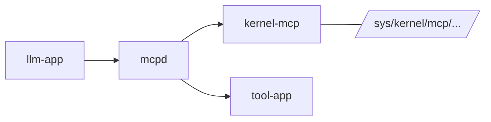
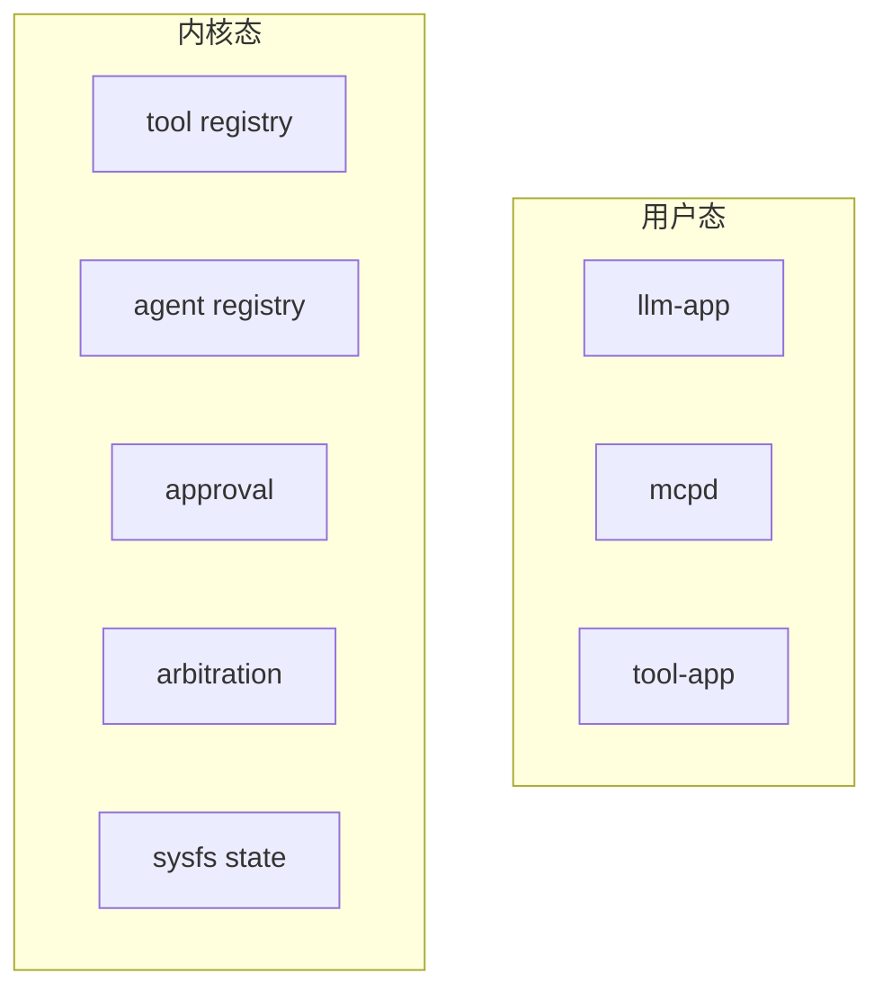
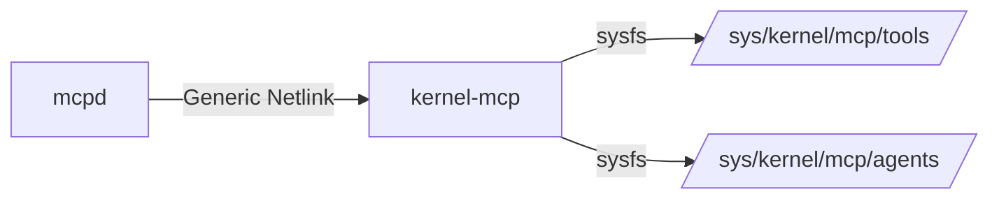
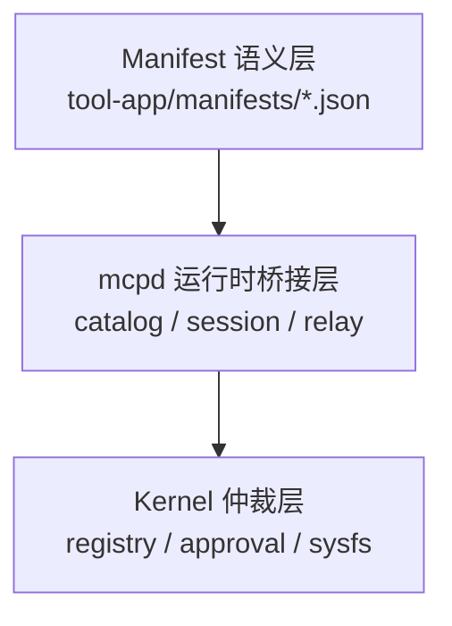
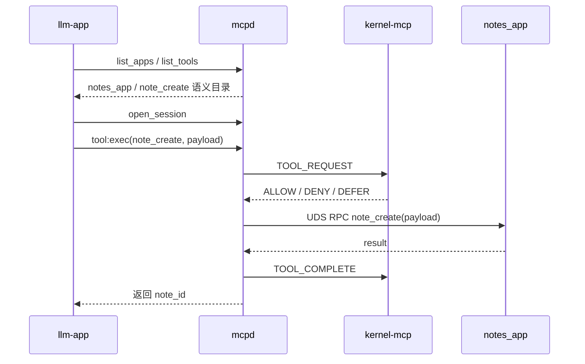

# linux-mcp 演示讲义

## 1. 项目实现

`linux-mcp` 是一套 **Kernel-assisted MCP 系统**：

- 工具执行留在用户态
- 工具控制面进入内核

这个项目把下面这些控制面能力放进内核：

- tool 注册状态
- agent 注册状态
- allow / deny / defer 仲裁
- approval ticket
- sysfs 状态暴露

### 为什么要内核参与？

如果一个工具系统完全只放在用户态，会有如下问题：

1. 控制面状态主要存在于 daemon 内存里，工具调用可以直接绕过daemon，或者可以fork一个新进程
2. 全局策略规则不一致，无法做到系统统一调度
3. 工具注册、agent pid绑定无法实现、审批状态缺少统一的系统级可观测面，容易被proxy，中转，或重放
4. 无法做可信记录，日志可以被轻易篡改


### 整体架构图：



## 2. 重点和创新点


### 创新点 1：控制面和执行面显式分离


- 内核只做 control plane
- 用户态继续负责语义和执行

这让系统边界非常明确：

<div style="zoom: 0.7;">


</div>

对应代码：

- manifest 加载：[mcpd/manifest_loader.py](mcpd/manifest_loader.py)
- 网关主逻辑：[mcpd/server.py](mcpd/server.py)
- 内核主逻辑：[kernel_mcp_main.c](kernel-mcp/src/kernel_mcp_main.c)

### 创新点 2：用 manifest 统一描述工具语义

这个项目没有把 tool 信息硬编码在客户端里，而是把语义来源统一放在 manifest。

可以简单分成两层：

- app 级字段：描述应用入口和传输方式
- tool 级字段：描述 tool 身份、风险、输入 schema 和示例

例如：[_notes_app.json](tool-app/manifests/01_notes_app.json)

其中语义相关字段会参与 [mcpd/manifest_loader.py](mcpd/manifest_loader.py) 里的 `manifest_hash` 计算；运行时接入则主要依赖 `transport`、`endpoint`、`operation`、`timeout_ms` 等字段。

对应代码：

- manifest 解析：[mcpd/manifest_loader.py](mcpd/manifest_loader.py)
- `llm-app` 读取 catalog：[llm-app/app_logic.py](llm-app/app_logic.py)


> `llm-app` 不需要知道某个 tool 的内部实现，只需要得到 `mcpd` 导出的语义目录。
- list_apps_public()
- list_tools_public(app_id)

### 创新点 3：内核维护控制面状态，并通过 Netlink + sysfs 对外工作

这里有两个关键接口：

- **Netlink**：`mcpd` 和内核之间发控制命令
- **sysfs**：把内核中的控制面状态暴露出来



对应代码：

- Netlink 协议定义：[kernel_mcp_schema.h](kernel-mcp/include/uapi/linux/kernel_mcp_schema.h)
- Python Netlink client：[mcpd/netlink_client.py](mcpd/netlink_client.py)
- sysfs / registry / 仲裁实现：[kernel_mcp_main.c](kernel-mcp/src/kernel_mcp_main.c)

## 3. 怎么实现的？


### 三层结构

<div style="zoom: 0.8;">



</div>

### 每层分别做什么

#### 1. Manifest 语义层

负责定义：

- tool 是什么
- tool 怎么给 LLM 看
- tool 的风险和输入格式是什么

关键代码：

- [01_notes_app.json](tool-app/manifests/01_notes_app.json)
- [mcpd/manifest_loader.py](mcpd/manifest_loader.py)

#### 2. `mcpd` 运行时桥接层

负责：

- 启动时加载 manifest
- 把 tool 注册到内核
- 暴露 `list_apps` / `list_tools` / `open_session` / `tool:exec`
- 校验 payload
- 把请求转发给 tool service

关键代码：

- `list_apps` / `list_tools`：[mcpd/server.py:880](mcpd/server.py#L880)
- `open_session`：[mcpd/server.py:907](mcpd/server.py#L907)
- `tool:exec` 主流程：[mcpd/server.py:704](mcpd/server.py#L704)
- 调用 tool service：[mcpd/server.py:612](mcpd/server.py#L612)

#### 3. Kernel 仲裁层

负责：

- `TOOL_REGISTER`
- `AGENT_REGISTER`
- `TOOL_REQUEST`
- `TOOL_COMPLETE`
- `APPROVAL_DECIDE`
- sysfs 状态树

#### 4. 当前仲裁规则

`kernel_mcp_cmd_tool_request()` 目前实现的是 demo 规则，而不是通用策略引擎：

- agent 未注册，拒绝
- tool 不存在，拒绝
- tool hash 不一致，拒绝
- binding mismatch，拒绝
- 高风险 flags 命中 approval gate，则 `DEFER`
- 其他情况 `ALLOW`


关键代码：

- tool register：[kernel_mcp_main.c:827](kernel-mcp/src/kernel_mcp_main.c#L827)
- tool request：[kernel_mcp_main.c:884](kernel-mcp/src/kernel_mcp_main.c#L884)
- tool complete：[kernel_mcp_main.c:1003](kernel-mcp/src/kernel_mcp_main.c#L1003)
- approval decide：[kernel_mcp_main.c:1049](kernel-mcp/src/kernel_mcp_main.c#L1049)
- sysfs init：[kernel_mcp_main.c:1254](kernel-mcp/src/kernel_mcp_main.c#L1254)

## 4. 完整流程

这里用 `notes_app / note_create` 作为例子。

对应 manifest：

- [01_notes_app.json](tool-app/manifests/01_notes_app.json)

对应 service 实现：

- [notes_app.py](tool-app/demo_apps/notes_app.py)

### tool 的语义

`note_create` 的作用是创建一条笔记，输入示例是：

```json
{
  "title": "Daily Standup",
  "body": "Blocked on schema sync review.",
  "notebook": "work",
  "tags": ["daily", "team"]
}
```

### 链路图



### 流程分解

#### 第一步：`llm-app` 先拿公开目录

`llm-app` 先通过 `mcpd` 获取公开 catalog：

- `{"sys":"list_apps"}`
- `{"sys":"list_tools"}`

对应代码：

- [llm-app/app_logic.py:86](llm-app/app_logic.py#L86)
- [mcpd/server.py:880](mcpd/server.py#L880)
- [mcpd/server.py:889](mcpd/server.py#L889)

#### 第二步：`llm-app` 建立 session

调用 `open_session`，由 `mcpd` 绑定 peer identity。

对应代码：

- [mcpd/server.py:907](mcpd/server.py#L907)

#### 第三步：发起 `tool:exec`

`llm-app` 发出类似请求：

```json
{
  "kind": "tool:exec",
  "session_id": "...",
  "app_id": "notes_app",
  "tool_id": 1,
  "tool_hash": "...",
  "payload": {
    "title": "Daily Standup",
    "body": "Blocked on schema sync review.",
    "notebook": "work",
    "tags": ["daily", "team"]
  }
}
```

对应代码：

- 构造请求：[llm-app/app_logic.py:401](llm-app/app_logic.py#L401)
- 服务端执行入口：[mcpd/server.py:704](mcpd/server.py#L704)

#### 第四步：`mcpd` 先去问内核

`mcpd` 先向内核发 `TOOL_REQUEST`。

对应代码：

- userspace netlink 请求：[mcpd/server.py:528](mcpd/server.py#L528)
- netlink client：[mcpd/netlink_client.py:365](mcpd/netlink_client.py#L365)
- kernel 处理：[kernel_mcp_main.c:884](kernel-mcp/src/kernel_mcp_main.c#L884)

#### 第五步：内核返回 allow / deny / defer

注意：当前内核是 demo 仲裁规则，不是通用策略引擎。

如果允许，`mcpd` 才继续往下转发。

#### 第六步：`mcpd` 转发给真实 tool service

这里会调用 `notes_app.sock` 上的 `note_create` operation。

对应代码：

- 转发入口：[mcpd/server.py:612](mcpd/server.py#L612)
- tool service 实现：[notes_app.py:61](tool-app/demo_apps/notes_app.py#L61)

`note_create` 最终会把数据写到：

- [tool-app/demo_data/notes](tool-app/demo_data/notes)

#### 第七步：执行完成后上报内核

`mcpd` 执行完成后，再调用 `TOOL_COMPLETE` 报告完成状态。

对应代码：

- [mcpd/server.py:572](mcpd/server.py#L572)
- [mcpd/netlink_client.py:440](mcpd/netlink_client.py#L440)
- [kernel_mcp_main.c:1003](kernel-mcp/src/kernel_mcp_main.c#L1003)


## 5. tool-app 说明

有一批 tool-app 不是纯 demo 数据服务，而是“真实 Linux 桌面应用的语义包装器/桥接器”。

### 5.1 `tool-app` 里其实有两类东西

第一类是纯 demo 数据服务，例如：

- `notes_app`
- `contacts_app`
- `planner_app`
- `calendar_app`
- `workspace_app`

这类 app 的特点是：

- tool service 自己直接实现业务逻辑

第二类是真实 Linux 应用的桥接器，例如：

- `browser_app`
- `code_editor_app`
- `document_viewer_app`
- `mail_client_app`
- `calendar_desktop_app`
- `file_manager_app`
- `launcher_app`
- `bridge_app`

这类 app 的特点是：

- 它们自己不是最终要操作的真实应用
- 它们充当的是“语义适配层”
- 它们把 MCP tool 调用翻译成真实Linux桌面应用能接受的调用方式


### 5.2 为什么需要这一层桥接器

因为大多数真实 Linux 桌面应用本身并不是 MCP 服务。

它们通常只支持下面这些接口：

- 命令行参数
- D-Bus 接口
- `.desktop` entry 启动
- `xdg-open` / `gio`

但 `linux-mcp` 系统内部需要的是统一的 tool 语义和统一的 RPC 入口。

所以这里加了一层 `tool-app` adapter，把：

“LLM 可理解的语义”请求转换成“真实应用能执行的调用方式”


### 5.3 当前代码里已经能桥接哪些真实应用

按当前代码，已经覆盖了几类典型桌面能力：

- 浏览器：[browser_app.py](tool-app/demo_apps/browser_app.py)
- 代码编辑器：[code_editor_app.py](tool-app/demo_apps/code_editor_app.py)
- 文档查看器：[document_viewer_app.py](tool-app/demo_apps/document_viewer_app.py)
- 邮件客户端：[mail_client_app.py](tool-app/demo_apps/mail_client_app.py)
- 日历、文件管理器、应用启动器、通用 bridge 和桌面能力：[calendar_desktop_app.py](tool-app/demo_apps/calendar_desktop_app.py)、[file_manager_app.py](tool-app/demo_apps/file_manager_app.py)、[launcher_app.py](tool-app/demo_apps/launcher_app.py)、[bridge_app.py](tool-app/demo_apps/bridge_app.py)、[desktop_app.py](tool-app/demo_apps/desktop_app.py)


### 5.4 真实 Linux 应用需要 adapter 才能被调用

普通桌面应用本身不提供 MCP 接口，需要一个 adapter 才能纳入系统。

> `tool-app` 里有两类服务：一类是纯 demo tool service，自己实现业务逻辑；另一类是把真实 Linux 桌面应用包装成语义工具的 adapter。adapter 的作用，就是把系统内部统一的 tool 调用，映射到宿主机真实应用各自不同的 CLI、D-Bus 或 desktop-entry 调用方式。

## 6. 现有不足


- 当前系统不是通用策略引擎
- 当前只支持 `uds_rpc`
